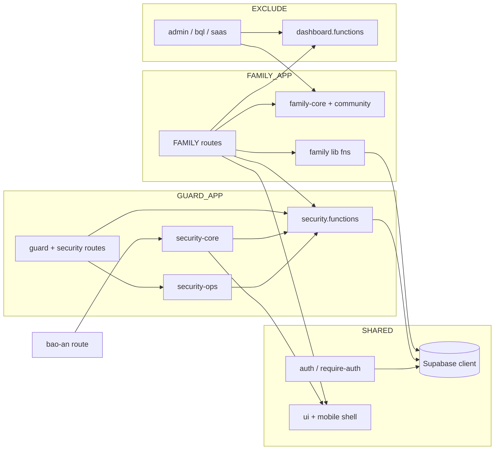

# MIGRATION_MAP — Tách TanStack Start → FAMILY APP + GUARD APP

> Phân tích tĩnh codebase `family-os` (TanStack Start). **Không sửa code.**  
> Ngày quét: 2026-05-23 · Tổng file đã quét: **routes 99**, **features 42**, **components 71**, **lib 31**, **hooks 6**, **contexts 2**.

## Tóm tắt

| Nhóm | Routes | Features | Lib (server fns) | Components (riêng) |
|------|--------|----------|------------------|---------------------|
| **FAMILY** | 24 | 18 | 11 (+ scan-receipt trong feature) | 0 (dùng SHARED shells) |
| **GUARD** | 12 | 12 | 1 (`security.functions`) | 0 |
| **SHARED** | 4 routes + infra | 2 | 8 | mobile 4 + ui 44 + common 4 + hooks/contexts/integrations |
| **EXCLUDE** | 59 | 10 | 12 | admin 5 + console 1 + workspace 2 + core 5 + rbac 1 |

**Ghi chú phân loại đặc biệt**

- `/family`, `/family/` — prefix giống FAMILY nhưng UI là **Family Core Governance** (`ConsoleShell`), không phải app cư dân → **EXCLUDE**.
- `/dashboard` — mobile tổng hợp gia đình → **FAMILY** (không nằm trong danh sách prefix user nhưng cùng shell cư dân).
- `/bao-an` — màn SOS/phản ánh cư dân; dùng `security-core` → **FAMILY** (biên giới nghiệp vụ chung với GUARD).
- `dashboard.functions.ts` — user rule ghi EXCLUDE; thực tế **3 route FAMILY** phụ thuộc → tách thành `family-dashboard.functions` khi migrate.

---

## FAMILY APP

### Routes (24 files)

- `src/routes/portal.tsx`
- `src/routes/home.tsx`
- `src/routes/gia-dinh.tsx`
- `src/routes/dashboard.tsx`
- `src/routes/con-cai.tsx`
- `src/routes/cham-soc-ong-ba.tsx`
- `src/routes/cham-soc-ong-ba.nhat-ky.tsx`
- `src/routes/chi-tieu.tsx`
- `src/routes/chi-tieu_.scan.tsx`
- `src/routes/thuc-pham.tsx`
- `src/routes/suc-khoe.tsx`
- `src/routes/suc-khoe.quan-ly.tsx`
- `src/routes/lich-gia-dinh.tsx`
- `src/routes/ky-niem-gia-dinh.tsx`
- `src/routes/quan-ly-giup-viec.tsx`
- `src/routes/du-lich.tsx`
- `src/routes/dich-vu.tsx`
- `src/routes/qr-vao-ra.tsx`
- `src/routes/bao-an.tsx` *(SOS / security hub cư dân — dùng `security-core`)*
- `src/routes/thong-bao.tsx`
- `src/routes/cai-dat.thong-bao.tsx`
- `src/routes/cong-dong.tsx`
- `src/routes/lien-he.tsx`
- `src/routes/tai-khoan.tsx`

### Features (18 files — `src/features/family-core/*` + `community`)

**family-core**

- `src/features/family-core/index.ts`
- `src/features/family-core/data.ts`
- `src/features/family-core/stubs.ts`
- `src/features/family-core/scan-receipt.functions.ts`
- `src/features/family-core/calendar/index.ts`
- `src/features/family-core/calendar/data.ts`
- `src/features/family-core/contacts/index.ts`
- `src/features/family-core/elderly-care/index.ts`
- `src/features/family-core/elderly-care/data.ts`
- `src/features/family-core/helper-management/index.ts`
- `src/features/family-core/helper-management/data.ts`
- `src/features/family-core/memories/index.ts`
- `src/features/family-core/memories/data.ts`

**community**

- `src/features/community/index.ts`
- `src/features/community/data.ts`

### Server functions (11 lib + 1 feature)

| File | Bảng / nghiệp vụ chính |
|------|-------------------------|
| `src/lib/children.functions.ts` | children, homeworks, school_schedules, achievements, parent_reminders |
| `src/lib/elderly-care.functions.ts` | elderly_profiles, care_notes, medicine_logs, safe_checks, medicine_reminders |
| `src/lib/expenses.functions.ts` | expenses, receipt_scans |
| `src/lib/family-events.functions.ts` | family_events |
| `src/lib/family-today.functions.ts` | families, family_members, children (tổng hợp ngày) |
| `src/lib/food.functions.ts` | food_items, shopping_items |
| `src/lib/health.functions.ts` | health_profiles, health_records, medicine_reminders, medical_appointments |
| `src/lib/notifications.functions.ts` | notifications |
| `src/lib/notification-prefs.functions.ts` | notification_preferences |
| `src/features/family-core/scan-receipt.functions.ts` | receipt_scans (OCR → expense) |

**Phụ thuộc EXCLUDE (cần tách khi migrate)**

- `src/lib/dashboard.functions.ts` — dùng bởi `portal`, `gia-dinh`, `dashboard` (tổng hợp đa module + `security_requests`).

### Components riêng

Không có thư mục `components/family/*`. Toàn bộ UI cư dân dựa trên **SHARED**: `MobileShell`, `BottomNav`, `SideNav`, `common/*`, `ui/*`.

### Hooks (2)

- `src/hooks/use-family-context.tsx`
- `src/hooks/use-notifications.tsx` *(chỉ FAMILY routes / bell)*

### DB tables (FAMILY)

| Table | Ghi chú RLS / nghiệp vụ |
|-------|-------------------------|
| `families` | Hộ gia đình |
| `family_members` | Thành viên trong hộ |
| `children` | Con cái |
| `homeworks` | Bài tập |
| `school_schedules` | Lịch học |
| `achievements` | Thành tích |
| `parent_reminders` | Nhắc phụ huynh |
| `elderly_profiles` | Hồ sơ người cao tuổi |
| `care_notes` | Nhật ký chăm sóc |
| `safe_checks` | Kiểm tra an toàn |
| `medicine_reminders` | Nhắc thuốc (elderly + health) |
| `medicine_logs` | Log uống thuốc |
| `medical_appointments` | Lịch khám |
| `health_profiles` | Hồ sơ sức khỏe |
| `health_records` | Bản ghi sức khỏe |
| `expenses` | Chi tiêu |
| `receipt_scans` | Quét hóa đơn |
| `food_items` | Thực phẩm tủ lạnh |
| `shopping_items` | Danh sách mua |
| `family_events` | Lịch sự kiện gia đình |
| `notifications` | Thông báo in-app |
| `notification_preferences` | Cài đặt thông báo |
| `profiles` | Hồ sơ user (cư dân) — **SHARED** với GUARD |

**Đọc thêm (FAMILY qua dashboard / SOS)**

- `security_requests` — cư dân tạo/theo dõi qua `/bao-an`, `/home`, chăm sóc ông bà (xem GUARD).

---

## GUARD APP

### Routes (12 files)

- `src/routes/guard.tsx`
- `src/routes/guard.index.tsx`
- `src/routes/guard.check-in.tsx`
- `src/routes/guard.check-out.tsx`
- `src/routes/guard.schedule.tsx`
- `src/routes/guard.patrol.tsx`
- `src/routes/guard.requests.tsx`
- `src/routes/guard.incident.tsx`
- `src/routes/guard.notifications.tsx`
- `src/routes/guard.account.tsx`
- `src/routes/security.tsx` *(Security Ops console — cloud roles)*
- `src/routes/security.index.tsx`

### Features (12 files)

**security-core**

- `src/features/security-core/index.ts`
- `src/features/security-core/data.ts`
- `src/features/security-core/components/SecurityShell.tsx`
- `src/features/security-core/components/SecurityRequestsTracker.tsx`

**security-ops**

- `src/features/security-ops/dashboard/widgets.tsx`
- `src/features/security-ops/dashboard/sosSchema.ts`
- `src/features/security-ops/dashboard/dispatchStore.ts`
- `src/features/security-ops/dashboard/SosTicketDrawer.tsx`
- `src/features/security-ops/dashboard/SosDispatchButton.tsx`
- `src/features/security-ops/dashboard/PatrolScheduleCard.tsx`
- `src/features/security-ops/dashboard/OpenSosCard.tsx`
- `src/features/security-ops/dashboard/IncidentDetailDrawer.tsx`
- `src/features/security-ops/dashboard/DispatchAssignmentsCard.tsx`

### Server functions (1 lib — mở rộng khi tách)

| File | Bảng / nghiệp vụ |
|------|------------------|
| `src/lib/security.functions.ts` | `security_requests`, `sos_events` (+ schema từ `sosSchema.ts`) |

**Có thể SHARED / EXCLUDE tùy login guard**

- `src/lib/projects-public.functions.ts` — dropdown dự án khi signup (`projects` table EXCLUDE schema).

### Components riêng

Không có `components/guard/*`. Guard mobile layout nằm inline trong `guard.tsx` (bottom tabs riêng). Security console dùng `ConsoleShell` (EXCLUDE shell, route GUARD).

### Hooks

- `src/hooks/use-auth.tsx` — **SHARED** (dùng bởi `guard.*`)

### DB tables (GUARD)

| Table | Ghi chú |
|-------|---------|
| `security_requests` | Yêu cầu an ninh / SOS từ cư dân |
| `sos_events` | Sự kiện SOS dispatch (security-ops) |
| `service_requests` | Yêu cầu dịch vụ (BQL/ops — liên quan patrol nếu mở rộng) |
| `profiles` | Nhân viên bảo vệ — **SHARED** |

---

## SHARED

### Routes (4 files — auth + root)

- `src/routes/__root.tsx`
- `src/routes/login.tsx`
- `src/routes/forgot-password.tsx`
- `src/routes/reset-password.tsx`

### Features (2 files)

- `src/features/shared/index.ts`
- `src/features/shared/data.ts` (`formatVND`, helpers)

### Server functions / lib (8 + infra)

| File | Vai trò |
|------|---------|
| `src/lib/auth.functions.ts` | Session, roles, `getMyContext` |
| `src/lib/require-auth.ts` | `beforeLoad` guard |
| `src/lib/resolve-destination.ts` | Post-login routing (family → `/home`, security → `/guard`) |
| `src/lib/resolve-destination.test.ts` | Tests |
| `src/lib/username.functions.ts` | Username login |
| `src/lib/username.functions.test.ts` | Tests |
| `src/lib/utils.ts` | `cn`, helpers |
| `src/lib/error-page.ts` | Error UI helpers |
| `src/lib/error-capture.ts` | Error reporting |
| `src/lib/projects-public.functions.ts` | Public `projects` list (signup) |

### Integrations — Supabase (5 files)

- `src/integrations/supabase/client.ts`
- `src/integrations/supabase/client.server.ts`
- `src/integrations/supabase/auth-middleware.ts`
- `src/integrations/supabase/auth-attacher.ts`
- `src/integrations/supabase/types.ts`

### Components — mobile shell (4 files)

> **Lưu ý:** Nav hard-code route FAMILY (`/home`, `/gia-dinh`, `/bao-an`…). Khi tách app cần **parameterize** hoặc duplicate cho GUARD.

- `src/components/mobile/MobileShell.tsx`
- `src/components/mobile/BottomNav.tsx`
- `src/components/mobile/SideNav.tsx`
- `src/components/mobile/shellLayout.ts`
- `src/components/mobile/StubPage.tsx`

### Components — UI primitives (44 files — shadcn)

- `src/components/ui/accordion.tsx` … `src/components/ui/tooltip.tsx` *(toàn bộ `src/components/ui/*`)*

### Components — common (4 files)

- `src/components/common/PageHeader.tsx`
- `src/components/common/RoundedCard.tsx`
- `src/components/common/States.tsx`
- `src/components/common/NotificationBell.tsx` *(link `/thong-bao` — FAMILY-coupled)*

### Hooks (4)

- `src/hooks/use-auth.tsx`
- `src/hooks/use-theme.tsx`
- `src/hooks/use-mobile.tsx`
- `src/hooks/use-easy-read.tsx`

### Components — misc SHARED

- `src/components/PagePendingSkeleton.tsx`
- `src/components/debug/AuthDebugPanel.tsx`

### DB tables (SHARED)

| Table | Ghi chú |
|-------|---------|
| `profiles` | Auth + metadata cư dân / guard |
| `user_roles` | RBAC (`family_*`, `security_*`, `bql_*`, `saas_*`) |
| `audit_logs` | Audit cross-domain |

---

## EXCLUDE

> Admin BQL, SaaS console, landing, demo, workspace picker — **không** đưa vào FAMILY/GUARD mobile.

### Routes (59 files)

**Landing / demo / workspace**

- `src/routes/index.tsx`
- `src/routes/demo.tsx`
- `src/routes/demo-login.tsx`
- `src/routes/workspaces.tsx`

**Family governance console** *(không phải app cư dân)*

- `src/routes/family.tsx`
- `src/routes/family.index.tsx`

**Admin** (12)

- `src/routes/admin.index.tsx`
- `src/routes/admin.users.tsx`
- `src/routes/admin.super.tsx`
- `src/routes/admin.security.tsx`
- `src/routes/admin.roles.tsx`
- `src/routes/admin.projects.tsx`
- `src/routes/admin.memories.tsx`
- `src/routes/admin.helpers.tsx`
- `src/routes/admin.family.tsx`
- `src/routes/admin.elderly-care.tsx`
- `src/routes/admin.calendar.tsx`
- `src/routes/admin.audit.tsx`

**BQL** (19)

- `src/routes/bql.tsx`
- `src/routes/bql.index.tsx`
- `src/routes/bql.yeu-cau.tsx`
- `src/routes/bql.toa-nha.tsx`
- `src/routes/bql.thong-bao.tsx`
- `src/routes/bql.thanh-toan.tsx`
- `src/routes/bql.su-co.tsx`
- `src/routes/bql.phi-dich-vu.tsx`
- `src/routes/bql.phan-anh.tsx`
- `src/routes/bql.nhan-su.tsx`
- `src/routes/bql.khach-xe.tsx`
- `src/routes/bql.ho-gia-dinh.tsx`
- `src/routes/bql.du-an.tsx`
- `src/routes/bql.cu-dan.tsx`
- `src/routes/bql.can-ho.tsx`
- `src/routes/bql.cai-dat.tsx`
- `src/routes/bql.bao-tri.tsx`
- `src/routes/bql.bao-cao.tsx`
- `src/routes/bql.an-ninh.tsx`

**SaaS** (12)

- `src/routes/saas.tsx`
- `src/routes/saas.index.tsx`
- `src/routes/saas.users.tsx`
- `src/routes/saas.tenants.tsx`
- `src/routes/saas.projects.tsx`
- `src/routes/saas.plans.tsx`
- `src/routes/saas.leads.tsx`
- `src/routes/saas.incidents.tsx`
- `src/routes/saas.feature-flags.tsx`
- `src/routes/saas.cai-dat.tsx`
- `src/routes/saas.billing.tsx`
- `src/routes/saas.audit.tsx`

**Ops** (7)

- `src/routes/ops.tsx`
- `src/routes/ops.index.tsx`
- `src/routes/ops.work-orders.tsx`
- `src/routes/ops.sla.tsx`
- `src/routes/ops.occupancy.tsx`
- `src/routes/ops.fee.tsx`
- `src/routes/ops.complaints.tsx`

**Console** (3)

- `src/routes/console.tsx`
- `src/routes/console.index.tsx`
- `src/routes/console.metrics.$key.tsx`

### Features (10 files)

**admin**

- `src/features/admin/index.ts`
- `src/features/admin/data.ts`

**console**

- `src/features/console/dashboard/ProjectTypeDonut.tsx`
- `src/features/console/dashboard/ProjectMap.tsx`
- `src/features/console/dashboard/PerformanceTriad.tsx`
- `src/features/console/dashboard/KpiStrip.tsx`
- `src/features/console/dashboard/GrowthChart.tsx`
- `src/features/console/dashboard/FooterStats.tsx`
- `src/features/console/dashboard/EcosystemStrip.tsx`
- `src/features/console/dashboard/AlertsPanel.tsx`

**ops**

- `src/features/ops/detail/RequestsDetail.tsx`
- `src/features/ops/dashboard/widgets.tsx`

### Server functions (12 lib)

- `src/lib/admin.functions.ts`
- `src/lib/super-admin.functions.ts`
- `src/lib/workspace-admin.functions.ts`
- `src/lib/workspaces.functions.ts`
- `src/lib/projects-admin.functions.ts`
- `src/lib/demo-leads.functions.ts`
- `src/lib/console-stats.functions.ts`
- `src/lib/dashboard.functions.ts` *(theo rule EXCLUDE; FAMILY đang borrow — xem WARNINGS)*
- `src/lib/bql.functions.ts`
- `src/lib/bql-context.tsx`
- `src/lib/services.ts`

### Components (14 files)

**admin**

- `src/components/admin/AdminSidebar.tsx`
- `src/components/admin/AdminShell.tsx`
- `src/components/admin/AdminGate.tsx`
- `src/components/admin/AdminFilterBar.tsx` *(import `family-core` — xem WARNINGS §4)*

**console / workspace**

- `src/components/console/ConsoleShell.tsx`
- `src/components/workspace/WorkspaceShell.tsx`
- `src/components/workspace/WorkspacePlaceholder.tsx`

**core (multi-tenant / CRUD consoles)**

- `src/components/core/TenantSwitcher.tsx`
- `src/components/core/RoleSwitcher.tsx`
- `src/components/core/StatusBadge.tsx`
- `src/components/core/States.tsx`
- `src/components/core/CrudScreen.tsx`
- `src/components/core/ProtectedRoute.tsx`

**rbac**

- `src/components/rbac/PermissionGate.tsx`

### Contexts (2 — mock SaaS/BQL)

- `src/contexts/MockAuthContext.tsx`
- `src/contexts/TenantContext.tsx`

### DB tables (EXCLUDE — platform / BQL)

| Table | Domain |
|-------|--------|
| `demo_leads` | Landing demo |
| `tenants` | SaaS |
| `projects` | SaaS / BQL |
| `blocks`, `floors`, `apartments` | BQL cấu trúc tòa nhà |
| `apartment_residents` | BQL cư dân căn hộ |
| `service_requests` | BQL vận hành *(overlap GUARD nếu guard xử lý ticket)* |

---

## DEPENDENCY WARNINGS (cross-imports cần xử lý)

### 1. FAMILY → GUARD (vi phạm ranh giới app — cần API/SDK chung)

| Nguồn (FAMILY) | Import | Hành động đề xuất |
|----------------|--------|-------------------|
| `src/routes/bao-an.tsx` | `@/features/security-core` (+ `security.functions`) | Tách **SOS SDK** shared: types + `createSecurityRequest`; UI guard riêng, UI cư dân riêng |
| `src/routes/home.tsx` | `@/lib/security.functions` (`getSecurityStatus`) | Trích `getSecurityStatus` → package `@family-os/security-client` hoặc edge function read-only |
| `src/routes/cham-soc-ong-ba.tsx` | `@/lib/security.functions` (`createSecurityRequest`) | Cùng SOS SDK; không import `security-core` UI |

### 2. GUARD → FAMILY

**Không phát hiện** import `@/features/family-core` hoặc family lib từ route/feature GUARD thuần (`guard.*` chỉ dùng `use-auth`, `supabase`, `utils`).

### 3. FAMILY → EXCLUDE lib

| Nguồn | Import | Hành động |
|-------|--------|-----------|
| `src/routes/portal.tsx` | `dashboard.functions` | Đổi tên/tách → `family-dashboard.functions.ts` trong FAMILY app |
| `src/routes/gia-dinh.tsx` | `dashboard.functions` | Idem |
| `src/routes/dashboard.tsx` | `dashboard.functions` | Idem |

### 4. EXCLUDE → FAMILY (chấp nhận được cho admin web; không copy sang mobile)

| Nguồn | Import |
|-------|--------|
| `src/routes/admin.memories.tsx` | `family-core/memories/data` |
| `src/routes/admin.helpers.tsx` | `family-core/helper-management/data` |
| `src/routes/admin.family.tsx` | `family-core`, `admin` |
| `src/routes/admin.elderly-care.tsx` | `family-core/elderly-care/data` |
| `src/routes/admin.calendar.tsx` | `family-core/calendar/data` |
| `src/components/admin/AdminFilterBar.tsx` | `family-core` (`family` mock filter) |

→ Giữ trong **monorepo admin package**; không đưa vào FAMILY/GUARD APK.

### 5. SHARED vi phạm / coupling ngầm (không import feature nhưng gắn route FAMILY)

| File SHARED | Vấn đề |
|-------------|--------|
| `src/components/mobile/BottomNav.tsx` | Tabs cố định `/home`, `/gia-dinh`, `/bao-an`, `/cong-dong`, `/tai-khoan` |
| `src/components/mobile/SideNav.tsx` | `matchPrefixes` chỉ cover module FAMILY |
| `src/features/security-core/SecurityShell.tsx` | Bọc `BottomNav`/`SideNav` FAMILY — **GUARD UI dùng nav cư dân** |
| `src/components/common/NotificationBell.tsx` | `to="/thong-bao"` |
| `src/lib/security.functions.ts` | Import `security-ops/.../sosSchema` — lib GUARD phụ thuộc feature GUARD (OK trong monolith; khi tách: schema → `packages/security-contract`) |

### 6. `features/shared` — OK

Không import `family-core`, `security-*`, `admin`, `console`, `ops`.

### 7. Root app providers (`__root.tsx`)

`MockAuthProvider` + `TenantProvider` phục vụ EXCLUDE consoles. FAMILY/GUARD app production nên **chỉ** `AuthProvider` + Supabase thật.

---

## Sơ đồ phụ thuộc (rút gọn)

---

## Checklist migrate (gợi ý thứ tự)

1. **SHARED package**: `integrations/supabase`, `auth.functions`, `utils`, `ui/*`, contract `profiles` / `user_roles`.
2. **Tách `family-dashboard.functions`** khỏi `dashboard.functions` (EXCLUDE).
3. **SOS contract**: `security_requests` + `sos_events` — client FAMILY (create/list own) + client GUARD (dispatch).
4. **FAMILY app**: 24 routes + `family-core` + community + mobile shell *(nav config)*.
5. **GUARD app**: 12 routes + `security-*` + guard layout *(không reuse BottomNav cư dân)*.
6. **EXCLUDE** giữ repo/platform hoặc repo `family-os-console` riêng.

---

*Generated by static analysis — import graph via `@/` path grep.*
