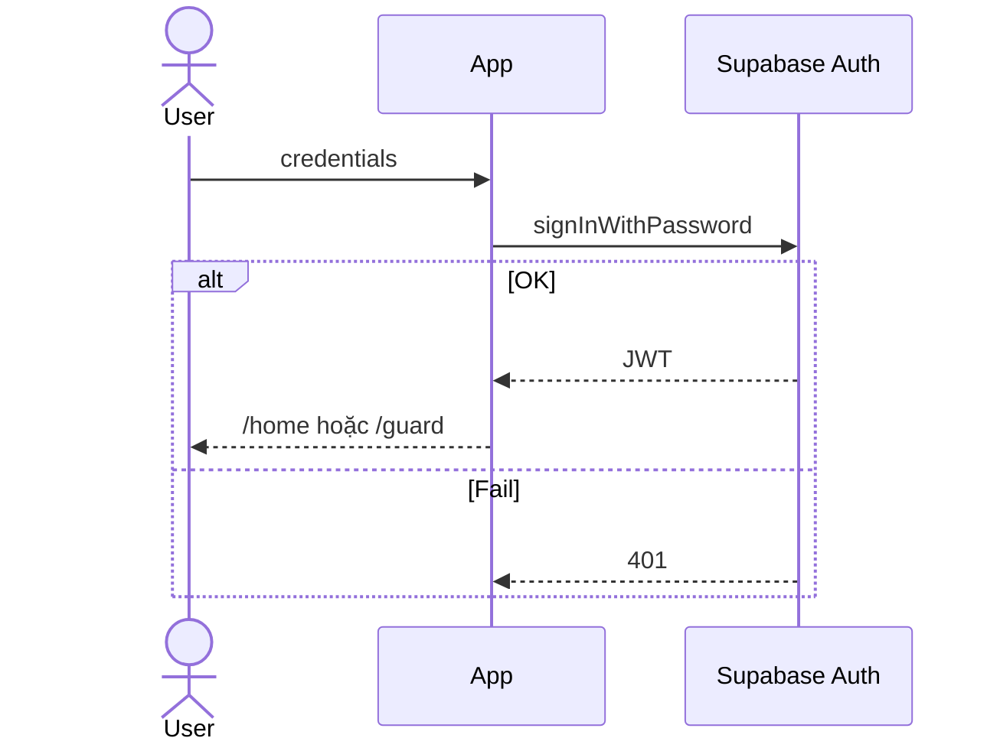
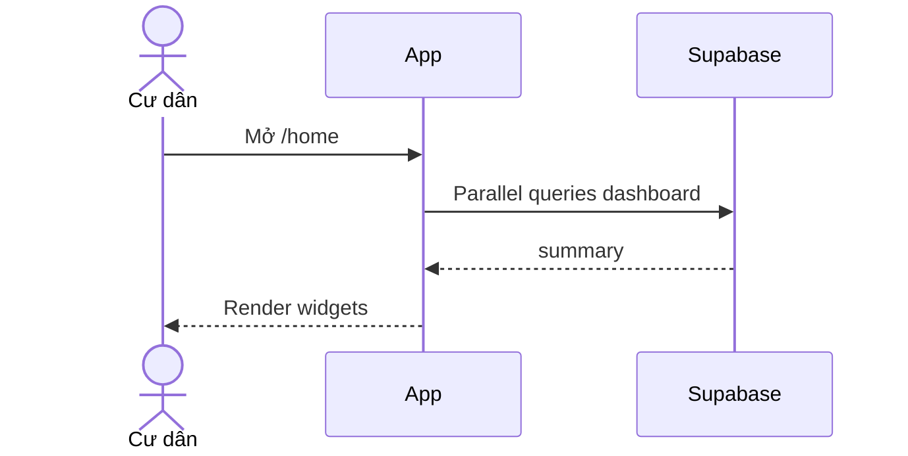
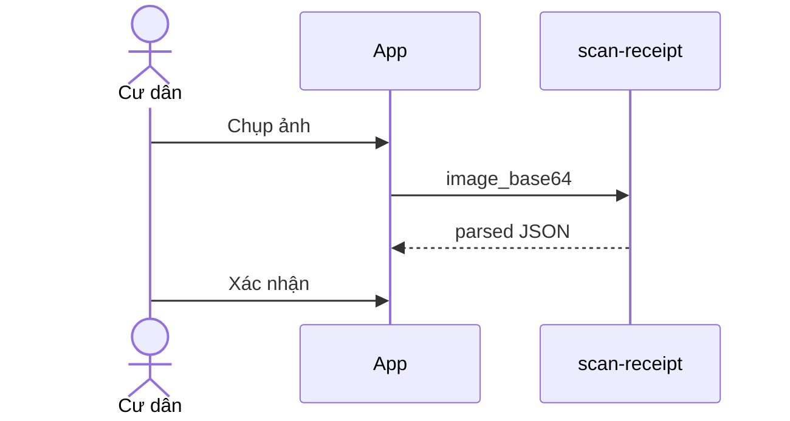
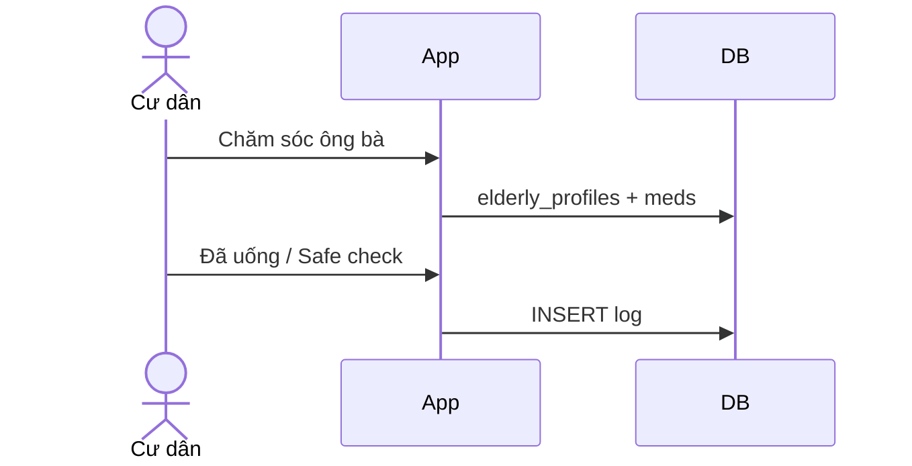
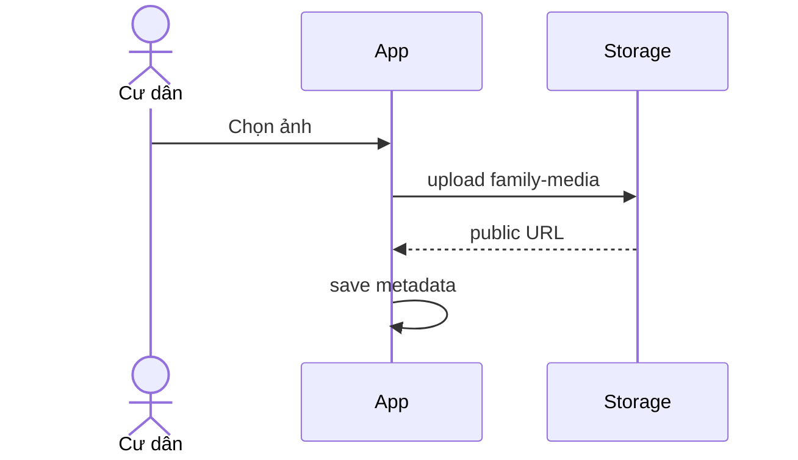
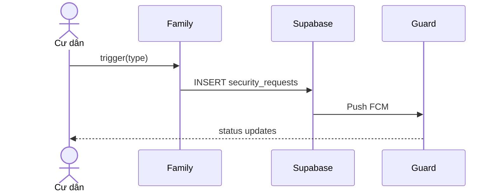
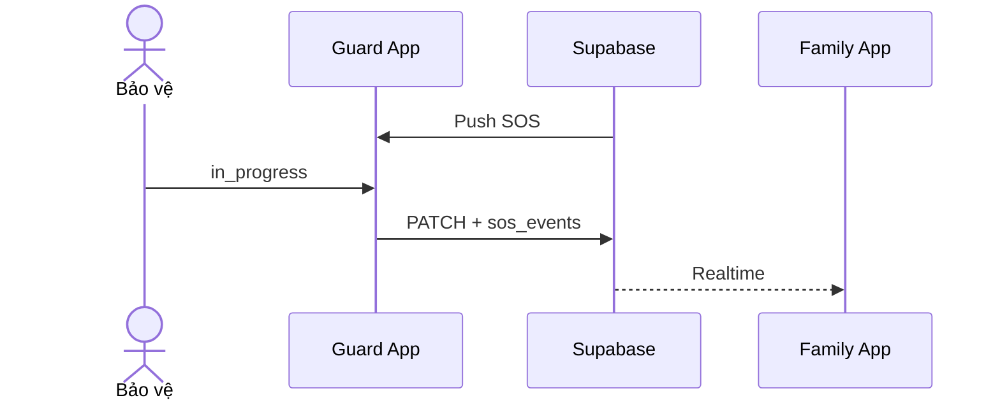

# 4A. CHI TIẾT USE CASE THEO MODULE (SRS v1.2)

> **Phạm vi v1.2:** Đặc tả **68 Use Case** thuộc **14 module**, phủ **16 luồng nghiệp vụ** BRD v1.2 — mức chi tiết tương đương TASMOS SRS v3.0.
>
> **Cấu trúc mỗi UC:** Metadata · Actor · Pre/Post-condition · Input + Validation · Main Flow · Alternative/Exception · Business Rules · Error Codes · Sequence Diagram · Acceptance Criteria.
>
> **Tài liệu nguồn:** UNICOM/BRD-FAMILYOS-001 v1.2 · Codebase `apps/family`, `apps/guard`, `packages/shared-supabase`

## 1. PHẠM VI 14 MODULE

| # | Module | Số UC | Luồng BRD |
|---|---|---|---|
| M01 | Authentication & RBAC | 5 | L0 |
| M02 | Dashboard & Gia đình | 4 | — |
| M03 | Chi tiêu & OCR | 6 | L2 |
| M04 | Con cái | 5 | L6 |
| M05 | Chăm sóc Ông bà | 8 | L5 |
| M06 | Sức khỏe gia đình | 5 | L7 |
| M07 | Lịch gia đình | 4 | L4 |
| M08 | Kỷ niệm & Media | 5 | L3 |
| M09 | Thực phẩm | 5 | L8 |
| M10 | Giúp việc | 3 | L9 |
| M11 | Bảo an mở rộng | 4 | L1, L10 |
| M12 | Thông báo | 3 | L11 |
| M13 | Cộng đồng & Tài khoản | 4 | L12 |
| M14 | STOS Guard App | 7 | L13, L14, L15 |
| **Tổng** | | **68 UC** | **16 luồng** |

---

## 2. CHI TIẾT USE CASE THEO MODULE

## M01 — AUTHENTICATION & RBAC

#### UC-01.01: Đăng nhập STOS Family / Guard

**Metadata:**

| Trường | Giá trị |
|---|---|
| ID | UC-01.01 |
| Module | M01 |
| Luồng BRD | L0 |
| Route / API | `/login` · `signInWithPassword` |
| Ưu tiên | P0 |
| Trigger | Người dùng thao tác trên mobile app |

**Tác nhân chính:** Cư dân, Nhân viên bảo vệ
**Bên liên quan:** Ban quản lý (BQL), thành viên gia đình khác (đọc dữ liệu chung)

**Điều kiện tiên quyết:**
- Tài khoản đã được cấp; app native đã cài.

**Điều kiện sau khi thành công:**
- JWT lưu Preferences; redirect `/home` hoặc Guard shell.

**Dữ liệu đầu vào và quy tắc kiểm tra:**

| Field | Type | Required | Validation rule |
|---|---|---|---|
| `email` | string | Conditional | Bắt buộc nếu không dùng username |
| `username` | string | Conditional | 3–32 ký tự, map sang email |
| `password` | string | Yes | ≥ 8 ký tự |

**Luồng chính:**
1. Mở `/login`, nhập credential.
2. FE validate format.
3. Gọi Supabase Auth `signInWithPassword`.
4. Đọc `user_roles` + `family_members`.
5. `resolve-destination` → Family `/home` hoặc Guard.
6. Cache session; invalidate queries dashboard.

**Luồng thay thế / ngoại lệ:**
- **[A1]** Sai mật khẩu → E-AUTH-001, message chung.
- **[A2]** Không có role app → E-AUTH-008.
- **[A3]** Mạng lỗi → retry + toast.

**Quy tắc nghiệp vụ:**

| ID | Quy tắc |
|---|---|
| **BR-AUTH-01** Session qua `@capacitor/preferences`. | — |
| **BR-AUTH-02** Không tiết lộ email tồn tại. | — |
| **BR-AUTH-03** Mọi login ghi audit (nếu bật). | — |

**Mã lỗi:**

| Code | HTTP | Message (VI) | Khi nào |
|---|---|---|---|
| `E-AUTH-001` | 401 | Email hoặc mật khẩu không đúng | Sai credential |
| `E-AUTH-008` | 403 | Tài khoản không dùng được trên ứng dụng này | Role mismatch app |

**Sơ đồ tuần tự:**

**Tiêu chí nghiệm thu:**
- ✅ P95 đăng nhập < 2s
- ✅ Redirect đúng role
- ✅ Session survive restart app

---

#### UC-01.02: Quên mật khẩu

**Metadata:**

| Trường | Giá trị |
|---|---|
| ID | UC-01.02 |
| Module | M01 |
| Luồng BRD | L0 |
| Route / API | `/forgot-password` |
| Ưu tiên | P0 |
| Trigger | Người dùng thao tác trên mobile app |

**Tác nhân chính:** Cư dân / Bảo vệ
**Bên liên quan:** Ban quản lý (BQL), thành viên gia đình khác (đọc dữ liệu chung)

**Điều kiện tiên quyết:**
- Biết email đăng ký.

**Điều kiện sau khi thành công:**
- Email reset gửi thành công (message chung).

**Dữ liệu đầu vào và quy tắc kiểm tra:**

| Field | Type | Required | Validation rule |
|---|---|---|---|
| `email` | string | Yes | RFC5322 |

**Luồng chính:**
1. Nhập email tại `/forgot-password`.
2. Gọi `resetPasswordForEmail` với redirect deep link.
3. Hiển thị toast thành công dù email có tồn tại hay không.

**Luồng thay thế / ngoại lệ:**
- **[A1]** Rate limit → E-AUTH-429.

**Quy tắc nghiệp vụ:**

| ID | Quy tắc |
|---|---|
| **BR-AUTH-04** Deep link `vn.unicom.stos.family://auth`. | — |

**Mã lỗi:**

| Code | HTTP | Message (VI) | Khi nào |
|---|---|---|---|
| `E-AUTH-429` | 429 | Vui lòng thử lại sau | Quá nhiều lần gửi |

**Tiêu chí nghiệm thu:**
- ✅ Không lộ email tồn tại
- ✅ Email template có link hợp lệ

---

#### UC-01.03: Đặt lại mật khẩu (deep link)

**Metadata:**

| Trường | Giá trị |
|---|---|
| ID | UC-01.03 |
| Module | M01 |
| Luồng BRD | L0 |
| Route / API | `/reset-password` |
| Ưu tiên | P0 |
| Trigger | Người dùng thao tác trên mobile app |

**Tác nhân chính:** User có link từ email
**Bên liên quan:** Ban quản lý (BQL), thành viên gia đình khác (đọc dữ liệu chung)

**Điều kiện tiên quyết:**
- Link hợp lệ, session recovery.

**Điều kiện sau khi thành công:**
- Mật khẩu mới active.

**Dữ liệu đầu vào và quy tắc kiểm tra:**

| Field | Type | Required | Validation rule |
|---|---|---|---|
| `password` | string | Yes | ≥ 8 ký tự |
| `confirm` | string | Yes | Khớp password |

**Luồng chính:**
1. App mở từ deep link auth.
2. Supabase parse hash token.
3. Form mật khẩu mới.
4. `updateUser({ password })`.
5. Redirect login.

**Luồng thay thế / ngoại lệ:**
- **[A1]** Link hết hạn → E-AUTH-010.

**Quy tắc nghiệp vụ:**

| ID | Quy tắc |
|---|---|
| **BR-AUTH-05** Xóa hash khỏi URL sau xử lý. | — |

**Mã lỗi:**

| Code | HTTP | Message (VI) | Khi nào |
|---|---|---|---|
| `E-AUTH-010` | 400 | Liên kết đã hết hạn | Token invalid/expired |

**Tiêu chí nghiệm thu:**
- ✅ Đổi mật khẩu thành công
- ✅ Login được với mật khẩu mới

---

#### UC-01.04: Phân quyền RBAC & RLS context

**Metadata:**

| Trường | Giá trị |
|---|---|
| ID | UC-01.04 |
| Module | M01 |
| Luồng BRD | L0 |
| Route / API | RLS policies |
| Ưu tiên | P0 |
| Trigger | Người dùng thao tác trên mobile app |

**Tác nhân chính:** Hệ thống
**Bên liên quan:** Ban quản lý (BQL), thành viên gia đình khác (đọc dữ liệu chung)

**Điều kiện tiên quyết:**
- User đã login.

**Điều kiện sau khi thành công:**
- Mọi query scoped `family_id`.

**Dữ liệu đầu vào và quy tắc kiểm tra:**

| Field | Type | Required | Validation rule |
|---|---|---|---|
| `role` | enum | Yes | family_owner|family_member|security_guard|security_supervisor |

**Luồng chính:**
1. JWT chứa `sub`.
2. Helper `is_family_member(family_id)` trên bảng feature.
3. Guard chỉ đọc `security_requests` toàn tòa / assigned.

**Luồng thay thế / ngoại lệ:**
- **[A1]** Truy cập bảng khác family → RLS deny.

**Quy tắc nghiệp vụ:**

| ID | Quy tắc |
|---|---|
| **BR-AUTH-06** Không bypass RLS ở client. | — |

**Mã lỗi:**

| Code | HTTP | Message (VI) | Khi nào |
|---|---|---|---|
| `E-RLS-001` | 403 | Không có quyền truy cập | RLS rejected |

**Tiêu chí nghiệm thu:**
- ✅ Family A không đọc data Family B
- ✅ Guard không sửa expenses

---

#### UC-01.05: Đăng xuất

**Metadata:**

| Trường | Giá trị |
|---|---|
| ID | UC-01.05 |
| Module | M01 |
| Luồng BRD | L0 |
| Route / API | Auth signOut |
| Ưu tiên | P1 |
| Trigger | Người dùng thao tác trên mobile app |

**Tác nhân chính:** User đã login
**Bên liên quan:** Ban quản lý (BQL), thành viên gia đình khác (đọc dữ liệu chung)

**Điều kiện tiên quyết:**
- —

**Điều kiện sau khi thành công:**
- Session cleared; về `/login`.

**Dữ liệu đầu vào và quy tắc kiểm tra:**

| Field | Type | Required | Validation rule |
|---|---|---|---|

**Luồng chính:**
1. Menu Tài khoản → Đăng xuất.
2. `signOut`.
3. Xóa Preferences.
4. Redirect `/login`.

**Luồng thay thế / ngoại lệ:**
- **[A1]** Offline → clear local vẫn logout UI.

**Quy tắc nghiệp vụ:**

| ID | Quy tắc |
|---|---|
| **BR-AUTH-07** Invalidate TanStack Query cache. | — |

**Mã lỗi:**

| Code | HTTP | Message (VI) | Khi nào |
|---|---|---|---|
| `E-AUTH-500` | 500 | Lỗi đăng xuất | Network |

**Tiêu chí nghiệm thu:**
- ✅ Không còn gọi API authenticated sau logout

---

## M02 — DASHBOARD & GIA ĐÌNH

#### UC-02.01: Xem Dashboard Home

**Metadata:**

| Trường | Giá trị |
|---|---|
| ID | UC-02.01 |
| Module | M02 |
| Luồng BRD | — |
| Route / API | `/home` · `dashboard.ts` |
| Ưu tiên | P0 |
| Trigger | Người dùng thao tác trên mobile app |

**Tác nhân chính:** Cư dân
**Bên liên quan:** Ban quản lý (BQL), thành viên gia đình khác (đọc dữ liệu chung)

**Điều kiện tiên quyết:**
- Đã login, có `family_id`.

**Điều kiện sau khi thành công:**
- Hiển thị chip an ninh, lịch hôm nay, shortcuts.

**Dữ liệu đầu vào và quy tắc kiểm tra:**

| Field | Type | Required | Validation rule |
|---|---|---|---|
| `family_id` | uuid | Yes | Từ session context |

**Luồng chính:**
1. Load `getDashboardSummary`.
2. Hiển thị SOS status, chi tiêu tháng, thực phẩm sắp hết hạn.
3. Shortcut 8 module.
4. Pull-to-refresh invalidate.

**Luồng thay thế / ngoại lệ:**
- **[A1]** API lỗi → skeleton + retry.

**Quy tắc nghiệp vụ:**

| ID | Quy tắc |
|---|---|
| **BR-DASH-01** P95 load < 1.5s cached. | — |

**Mã lỗi:**

| Code | HTTP | Message (VI) | Khi nào |
|---|---|---|---|
| `E-DASH-001` | 500 | Không tải được tổng quan | API fail |

**Sơ đồ tuần tự:**

**Tiêu chí nghiệm thu:**
- ✅ Đủ 4 widget chính
- ✅ Refresh cập nhật số liệu

---

#### UC-02.02: Quản lý thành viên gia đình

**Metadata:**

| Trường | Giá trị |
|---|---|
| ID | UC-02.02 |
| Module | M02 |
| Luồng BRD | — |
| Route / API | `/gia-dinh` |
| Ưu tiên | P0 |
| Trigger | Người dùng thao tác trên mobile app |

**Tác nhân chính:** Chủ hộ (owner)
**Bên liên quan:** Ban quản lý (BQL), thành viên gia đình khác (đọc dữ liệu chung)

**Điều kiện tiên quyết:**
- Đã login.

**Điều kiện sau khi thành công:**
- Danh sách `family_members` + profiles.

**Dữ liệu đầu vào và quy tắc kiểm tra:**

| Field | Type | Required | Validation rule |
|---|---|---|---|
| `family_id` | uuid | Yes | RLS member |

**Luồng chính:**
1. List members với avatar, role.
2. Quick action tới module theo thành viên.
3. Owner mời thành viên (Phase 2 email invite).

**Luồng thay thế / ngoại lệ:**
- **[A1]** Member chỉ xem, không xóa owner.

**Quy tắc nghiệp vụ:**

| ID | Quy tắc |
|---|---|
| **BR-FAM-01** Chỉ `family_owner` mời/xóa member. | — |

**Mã lỗi:**

| Code | HTTP | Message (VI) | Khi nào |
|---|---|---|---|
| `E-FAM-001` | 403 | Chỉ chủ hộ mới thực hiện | Not owner |

**Tiêu chí nghiệm thu:**
- ✅ Hiển thị đúng số thành viên
- ✅ Avatar và role chính xác

---

#### UC-02.03: Điều hướng BottomNav 5 tab

**Metadata:**

| Trường | Giá trị |
|---|---|
| ID | UC-02.03 |
| Module | M02 |
| Luồng BRD | — |
| Route / API | MobileShell |
| Ưu tiên | P0 |
| Trigger | Người dùng thao tác trên mobile app |

**Tác nhân chính:** Cư dân
**Bên liên quan:** Ban quản lý (BQL), thành viên gia đình khác (đọc dữ liệu chung)

**Điều kiện tiên quyết:**
- Authenticated.

**Điều kiện sau khi thành công:**
- Tab active đúng route.

**Dữ liệu đầu vào và quy tắc kiểm tra:**

| Field | Type | Required | Validation rule |
|---|---|---|---|

**Luồng chính:**
1. Tap Home/Gia đình/Bảo an/Cộng đồng/Tài khoản.
2. Preserve stack mỗi tab.

**Luồng thay thế / ngoại lệ:**
- **[A1]** Deep link override tab tạm thời.

**Quy tắc nghiệp vụ:**

| ID | Quy tắc |
|---|---|
| **BR-NAV-01** Touch target ≥ 44px. | — |

**Mã lỗi:**

| Code | HTTP | Message (VI) | Khi nào |
|---|---|---|---|
| `E-NAV-001` | — | — | — |

**Tiêu chí nghiệm thu:**
- ✅ 5 tab hoạt động
- ✅ Back không mất state tab

---

#### UC-02.04: SideNav — danh sách module

**Metadata:**

| Trường | Giá trị |
|---|---|
| ID | UC-02.04 |
| Module | M02 |
| Luồng BRD | — |
| Route / API | SideNav swipe |
| Ưu tiên | P1 |
| Trigger | Người dùng thao tác trên mobile app |

**Tác nhân chính:** Cư dân
**Bên liên quan:** Ban quản lý (BQL), thành viên gia đình khác (đọc dữ liệu chung)

**Điều kiện tiên quyết:**
- Authenticated.

**Điều kiện sau khi thành công:**
- Truy cập module phụ.

**Dữ liệu đầu vào và quy tắc kiểm tra:**

| Field | Type | Required | Validation rule |
|---|---|---|---|

**Luồng chính:**
1. Swipe hoặc menu mở SideNav.
2. Liệt kê 12 module + badge unread (nếu có).
3. Navigate tới route tương ứng.

**Luồng thay thế / ngoại lệ:**
- **[A1]** Module P2 hiển thị nhãn 'Sắp ra mắt'.

**Quy tắc nghiệp vụ:**

| ID | Quy tắc |
|---|---|
| **BR-NAV-02** aria-label tiếng Việt. | — |

**Mã lỗi:**

| Code | HTTP | Message (VI) | Khi nào |
|---|---|---|---|

**Tiêu chí nghiệm thu:**
- ✅ Mở được SideNav
- ✅ Điều hướng đúng route

---

## M03 — CHI TIÊU & OCR

#### UC-03.01: Danh sách chi tiêu & báo cáo tháng

**Metadata:**

| Trường | Giá trị |
|---|---|
| ID | UC-03.01 |
| Module | M03 |
| Luồng BRD | L2 |
| Route / API | `/chi-tieu` · `listExpenses` |
| Ưu tiên | P0 |
| Trigger | Người dùng thao tác trên mobile app |

**Tác nhân chính:** Cư dân
**Bên liên quan:** Ban quản lý (BQL), thành viên gia đình khác (đọc dữ liệu chung)

**Điều kiện tiên quyết:**
- Có `family_id`.

**Điều kiện sau khi thành công:**
- Danh sách expenses + pending receipt_scans.

**Dữ liệu đầu vào và quy tắc kiểm tra:**

| Field | Type | Required | Validation rule |
|---|---|---|---|
| `family_id` | uuid | Yes | — |

**Luồng chính:**
1. Gọi `listExpenses` merge manual + scan chưa gắn expense.
2. Group theo tháng, tổng VND.
3. Filter category (UI).

**Luồng thay thế / ngoại lệ:**
- **[A1]** Không có data → empty state.

**Quy tắc nghiệp vụ:**

| ID | Quy tắc |
|---|---|
| **BR-EXP-01** Max 100 bản ghi gần nhất. | — |

**Mã lỗi:**

| Code | HTTP | Message (VI) | Khi nào |
|---|---|---|---|
| `E-EXP-001` | 500 | Không tải chi tiêu | DB error |

**Tiêu chí nghiệm thu:**
- ✅ Tổng tháng khớp sum amounts
- ✅ Scan pending hiển thị badge

---

#### UC-03.02: Quét hóa đơn OCR

**Metadata:**

| Trường | Giá trị |
|---|---|
| ID | UC-03.02 |
| Module | M03 |
| Luồng BRD | L2 |
| Route / API | `/chi-tieu/scan` · Edge `scan-receipt` |
| Ưu tiên | P0 |
| Trigger | Người dùng thao tác trên mobile app |

**Tác nhân chính:** Cư dân
**Bên liên quan:** Ban quản lý (BQL), thành viên gia đình khác (đọc dữ liệu chung)

**Điều kiện tiên quyết:**
- Camera permission.

**Điều kiện sau khi thành công:**
- receipt_scans row hoặc form prefilled.

**Dữ liệu đầu vào và quy tắc kiểm tra:**

| Field | Type | Required | Validation rule |
|---|---|---|---|
| `image_base64` | string | Yes | ≤ 4MB JPEG/PNG |

**Luồng chính:**
1. Chụp/chọn ảnh Capacitor.
2. POST Edge Function + JWT.
3. Nhận `{title, amount, category, spent_on}`.
4. Navigate `/chi-tieu/them`.

**Luồng thay thế / ngoại lệ:**
- **[A1]** OCR fail → nhập tay.
- **[A2]** Timeout → retry 1.
- **[A3]** JWT invalid → login.

**Quy tắc nghiệp vụ:**

| ID | Quy tắc |
|---|---|
| **BR-EXP-02** Không auto-save — user confirm. | — |
| **BR-EXP-03** amount int VND. | — |

**Mã lỗi:**

| Code | HTTP | Message (VI) | Khi nào |
|---|---|---|---|
| `E-EXP-002` | 422 | Số tiền không hợp lệ | amount≤0 |
| `E-EXP-OCR` | 502 | Không đọc được hóa đơn | Vision fail |

**Sơ đồ tuần tự:**

**Tiêu chí nghiệm thu:**
- ✅ OCR trả JSON hợp lệ ≥80% testcase mẫu
- ✅ User có thể sửa trước khi lưu

---

#### UC-03.03: Thêm khoản chi thủ công

**Metadata:**

| Trường | Giá trị |
|---|---|
| ID | UC-03.03 |
| Module | M03 |
| Luồng BRD | L2 |
| Route / API | `/chi-tieu/them` · `createExpense` |
| Ưu tiên | P0 |
| Trigger | Người dùng thao tác trên mobile app |

**Tác nhân chính:** Cư dân
**Bên liên quan:** Ban quản lý (BQL), thành viên gia đình khác (đọc dữ liệu chung)

**Điều kiện tiên quyết:**
- Authenticated.

**Điều kiện sau khi thành công:**
- Row `expenses` created.

**Dữ liệu đầu vào và quy tắc kiểm tra:**

| Field | Type | Required | Validation rule |
|---|---|---|---|
| `title` | string | Yes | 1–120 chars |
| `amount` | int | Yes | 0–1e9 VND |
| `category` | string | Yes | 1–40 chars |
| `spent_on` | date | Yes | ISO date |
| `scan_id` | uuid | No | Link receipt_scans nếu từ OCR |

**Luồng chính:**
1. Điền form Zod validate.
2. `createExpense` INSERT.
3. Toast thành công.
4. Back `/chi-tieu`.

**Luồng thay thế / ngoại lệ:**
- **[A1]** Validation fail → inline errors.

**Quy tắc nghiệp vụ:**

| ID | Quy tắc |
|---|---|
| **BR-EXP-04** `created_by` = userId. | — |

**Mã lỗi:**

| Code | HTTP | Message (VI) | Khi nào |
|---|---|---|---|
| `E-EXP-003` | 400 | Vui lòng kiểm tra lại thông tin | Zod fail |

**Tiêu chí nghiệm thu:**
- ✅ Expense xuất hiện đầu danh sách
- ✅ scan_id link đúng nếu có

---

#### UC-03.04: Xóa khoản chi

**Metadata:**

| Trường | Giá trị |
|---|---|
| ID | UC-03.04 |
| Module | M03 |
| Luồng BRD | L2 |
| Route / API | `deleteExpense` |
| Ưu tiên | P1 |
| Trigger | Người dùng thao tác trên mobile app |

**Tác nhân chính:** Cư dân
**Bên liên quan:** Ban quản lý (BQL), thành viên gia đình khác (đọc dữ liệu chung)

**Điều kiện tiên quyết:**
- Expense tồn tại, cùng family.

**Điều kiện sau khi thành công:**
- Row deleted.

**Dữ liệu đầu vào và quy tắc kiểm tra:**

| Field | Type | Required | Validation rule |
|---|---|---|---|
| `id` | uuid | Yes | — |

**Luồng chính:**
1. Long press hoặc nút xóa.
2. Confirm dialog.
3. `deleteExpense`.
4. Invalidate list.

**Luồng thay thế / ngoại lệ:**
- **[A1]** RLS deny → toast lỗi.

**Quy tắc nghiệp vụ:**

| ID | Quy tắc |
|---|---|
| **BR-EXP-05** Không xóa expense người khác nếu policy hạn chế (owner only — tùy config). | — |

**Mã lỗi:**

| Code | HTTP | Message (VI) | Khi nào |
|---|---|---|---|
| `E-EXP-004` | 403 | Không thể xóa | RLS |

**Tiêu chí nghiệm thu:**
- ✅ Xóa thành công biến mất khỏi UI

---

#### UC-03.05: Xác nhận bản ghi từ scan chưa liên kết

**Metadata:**

| Trường | Giá trị |
|---|---|
| ID | UC-03.05 |
| Module | M03 |
| Luồng BRD | L2 |
| Route / API | receipt_scans |
| Ưu tiên | P0 |
| Trigger | Người dùng thao tác trên mobile app |

**Tác nhân chính:** Cư dân
**Bên liên quan:** Ban quản lý (BQL), thành viên gia đình khác (đọc dữ liệu chung)

**Điều kiện tiên quyết:**
- Có receipt_scans.expense_id null.

**Điều kiện sau khi thành công:**
- expense_id populated.

**Dữ liệu đầu vào và quy tắc kiểm tra:**

| Field | Type | Required | Validation rule |
|---|---|---|---|
| `scan_id` | uuid | Yes | — |

**Luồng chính:**
1. Chọn dòng source=scan.
2. Mở form prefilled.
3. Lưu như UC-03.03 với scan_id.

**Luồng thay thế / ngoại lệ:**
- **[A1]** Scan đã link → mở read-only.

**Quy tắc nghiệp vụ:**

| ID | Quy tắc |
|---|---|
| **BR-EXP-06** Một scan chỉ link một expense. | — |

**Mã lỗi:**

| Code | HTTP | Message (VI) | Khi nào |
|---|---|---|---|
| `E-EXP-005` | 409 | Hóa đơn đã được ghi nhận | expense_id set |

**Tiêu chí nghiệm thu:**
- ✅ Sau lưu scan không còn trong pending list

---

#### UC-03.06: So sánh chi tiêu tháng trước

**Metadata:**

| Trường | Giá trị |
|---|---|
| ID | UC-03.06 |
| Module | M03 |
| Luồng BRD | L2 |
| Route / API | dashboard expenses |
| Ưu tiên | P1 |
| Trigger | Người dùng thao tác trên mobile app |

**Tác nhân chính:** Cư dân
**Bên liên quan:** Ban quản lý (BQL), thành viên gia đình khác (đọc dữ liệu chung)

**Điều kiện tiên quyết:**
- Có dữ liệu 2 tháng.

**Điều kiện sau khi thành công:**
- Hiển thị % thay đổi.

**Dữ liệu đầu vào và quy tắc kiểm tra:**

| Field | Type | Required | Validation rule |
|---|---|---|---|
| `family_id` | uuid | Yes | — |

**Luồng chính:**
1. Dashboard query `expenses_month` và `expenses_prev_month`.
2. Hiển thị arrow up/down.

**Luồng thay thế / ngoại lệ:**
- **[A1]** Tháng trước = 0 → hiển thị '—'.

**Quy tắc nghiệp vụ:**

| ID | Quy tắc |
|---|---|
| **BR-EXP-07** Tính theo timezone VN. | — |

**Mã lỗi:**

| Code | HTTP | Message (VI) | Khi nào |
|---|---|---|---|

**Tiêu chí nghiệm thu:**
- ✅ % chính xác với SQL aggregate

---

## M04 — CON CÁI

#### UC-04.01: Xem hồ sơ & lịch học con

**Metadata:**

| Trường | Giá trị |
|---|---|
| ID | UC-04.01 |
| Module | M04 |
| Luồng BRD | L6 |
| Route / API | `/con-cai` · `listChildren` |
| Ưu tiên | P0 |
| Trigger | Người dùng thao tác trên mobile app |

**Tác nhân chính:** Phụ huynh
**Bên liên quan:** Ban quản lý (BQL), thành viên gia đình khác (đọc dữ liệu chung)

**Điều kiện tiên quyết:**
- Đã login, có family_id.

**Điều kiện sau khi thành công:**
- Hiển thị children + schedules + homeworks.

**Dữ liệu đầu vào và quy tắc kiểm tra:**

| Field | Type | Required | Validation rule |
|---|---|---|---|
| `family_id` | uuid | Yes | — |

**Luồng chính:**
1. Mở `/con-cai`.
2. Tab Hồ sơ / Lịch / Bài tập / Thành tích.
3. Parallel fetch 5 bảng.

**Luồng thay thế / ngoại lệ:**
- **[A1]** RLS deny.

**Quy tắc nghiệp vụ:**

| ID | Quy tắc |
|---|---|
| **BR-CHILD-01** | Parallel fetch 5 bảng. |

**Mã lỗi:**

| Code | HTTP | Message (VI) | Khi nào |
|---|---|---|---|
| `E-CHILD-001` | 500 | Lỗi tải dữ liệu con | API |

**Tiêu chí nghiệm thu:**
- ✅ UI phản ánh DB

---

#### UC-04.02: Cập nhật bài tập — đánh dấu hoàn thành

**Metadata:**

| Trường | Giá trị |
|---|---|
| ID | UC-04.02 |
| Module | M04 |
| Luồng BRD | L6 |
| Route / API | homeworks |
| Ưu tiên | P0 |
| Trigger | Người dùng thao tác trên mobile app |

**Tác nhân chính:** Phụ huynh
**Bên liên quan:** Ban quản lý (BQL), thành viên gia đình khác (đọc dữ liệu chung)

**Điều kiện tiên quyết:**
- Có homework id.

**Điều kiện sau khi thành công:**
- done=true trong DB.

**Dữ liệu đầu vào và quy tắc kiểm tra:**

| Field | Type | Required | Validation rule |
|---|---|---|---|
| `family_id` | uuid | Yes | — |

**Luồng chính:**
1. Toggle done trên UI.
2. UPDATE homeworks.
3. Refresh list.

**Luồng thay thế / ngoại lệ:**
- **[A1]** RLS deny.

**Quy tắc nghiệp vụ:**

| ID | Quy tắc |
|---|---|
| **BR-CHILD-02** | due_date quá hạn highlight đỏ. |

**Mã lỗi:**

| Code | HTTP | Message (VI) | Khi nào |
|---|---|---|---|
| `E-CHILD-001` | 500 | Lỗi tải dữ liệu con | API |

**Tiêu chí nghiệm thu:**
- ✅ UI phản ánh DB

---

#### UC-04.03: Thêm / sửa hồ sơ con

**Metadata:**

| Trường | Giá trị |
|---|---|
| ID | UC-04.03 |
| Module | M04 |
| Luồng BRD | L6 |
| Route / API | upsertChild |
| Ưu tiên | P1 |
| Trigger | Người dùng thao tác trên mobile app |

**Tác nhân chính:** Phụ huynh
**Bên liên quan:** Ban quản lý (BQL), thành viên gia đình khác (đọc dữ liệu chung)

**Điều kiện tiên quyết:**
- Đã login.

**Điều kiện sau khi thành công:**
- child row persisted.

**Dữ liệu đầu vào và quy tắc kiểm tra:**

| Field | Type | Required | Validation rule |
|---|---|---|---|
| `family_id` | uuid | Yes | — |

**Luồng chính:**
1. Form name, dob, school, grade.
2. Gọi upsertChild.
3. Toast + refresh.

**Luồng thay thế / ngoại lệ:**
- **[A1]** RLS deny.

**Quy tắc nghiệp vụ:**

| ID | Quy tắc |
|---|---|

**Mã lỗi:**

| Code | HTTP | Message (VI) | Khi nào |
|---|---|---|---|
| `E-CHILD-001` | 500 | Lỗi tải dữ liệu con | API |

**Tiêu chí nghiệm thu:**
- ✅ UI phản ánh DB

---

#### UC-04.04: Ghi thành tích

**Metadata:**

| Trường | Giá trị |
|---|---|
| ID | UC-04.04 |
| Module | M04 |
| Luồng BRD | L6 |
| Route / API | achievements |
| Ưu tiên | P2 |
| Trigger | Người dùng thao tác trên mobile app |

**Tác nhân chính:** Phụ huynh
**Bên liên quan:** Ban quản lý (BQL), thành viên gia đình khác (đọc dữ liệu chung)

**Điều kiện tiên quyết:**
- Đã login.

**Điều kiện sau khi thành công:**
- achievement row.

**Dữ liệu đầu vào và quy tắc kiểm tra:**

| Field | Type | Required | Validation rule |
|---|---|---|---|
| `family_id` | uuid | Yes | — |

**Luồng chính:**
1. Form title, kind, earned_at.
2. INSERT achievements.
3. Hiển thị tab Thành tích.

**Luồng thay thế / ngoại lệ:**
- **[A1]** RLS deny.

**Quy tắc nghiệp vụ:**

| ID | Quy tắc |
|---|---|

**Mã lỗi:**

| Code | HTTP | Message (VI) | Khi nào |
|---|---|---|---|
| `E-CHILD-001` | 500 | Lỗi tải dữ liệu con | API |

**Tiêu chí nghiệm thu:**
- ✅ UI phản ánh DB

---

#### UC-04.05: Nhắc phụ huynh

**Metadata:**

| Trường | Giá trị |
|---|---|
| ID | UC-04.05 |
| Module | M04 |
| Luồng BRD | L6 |
| Route / API | parent_reminders |
| Ưu tiên | P1 |
| Trigger | Người dùng thao tác trên mobile app |

**Tác nhân chính:** Phụ huynh
**Bên liên quan:** Ban quản lý (BQL), thành viên gia đình khác (đọc dữ liệu chung)

**Điều kiện tiên quyết:**
- Đã login.

**Điều kiện sau khi thành công:**
- reminder row.

**Dữ liệu đầu vào và quy tắc kiểm tra:**

| Field | Type | Required | Validation rule |
|---|---|---|---|
| `family_id` | uuid | Yes | — |

**Luồng chính:**
1. Tạo remind_at.
2. Hiển thị trên dashboard khi đến hạn.

**Luồng thay thế / ngoại lệ:**
- **[A1]** RLS deny.

**Quy tắc nghiệp vụ:**

| ID | Quy tắc |
|---|---|

**Mã lỗi:**

| Code | HTTP | Message (VI) | Khi nào |
|---|---|---|---|
| `E-CHILD-001` | 500 | Lỗi tải dữ liệu con | API |

**Tiêu chí nghiệm thu:**
- ✅ UI phản ánh DB

---

## M05 — CHĂM SÓC ÔNG BÀ

#### UC-05.01: Danh sách hồ sơ người cao tuổi

**Metadata:**

| Trường | Giá trị |
|---|---|
| ID | UC-05.01 |
| Module | M05 |
| Luồng BRD | L5 |
| Route / API | listElderlyProfiles |
| Ưu tiên | P0 |
| Trigger | Người dùng thao tác trên mobile app |

**Tác nhân chính:** Cư dân / Người chăm sóc
**Bên liên quan:** Ban quản lý (BQL), thành viên gia đình khác (đọc dữ liệu chung)

**Điều kiện tiên quyết:**
- Đã login, có elderly hoặc tạo mới.

**Điều kiện sau khi thành công:**
- DB cập nhật tương ứng.

**Dữ liệu đầu vào và quy tắc kiểm tra:**

| Field | Type | Required | Validation rule |
|---|---|---|---|
| `familyId` | uuid | Yes | — |
| `elderly_id` | uuid | Conditional | Khi thao tác trên 1 người |

**Luồng chính:**
1. Mở module Chăm sóc ông bà.
2. Thực hiện thao tác Danh sách hồ sơ người cao tuổi.
3. Toast + refresh activity feed.

**Luồng thay thế / ngoại lệ:**
- **[A1]** Không có hồ sơ → CTA tạo mới.
- **[A2]** SOS → chuyển Luồng L1.

**Quy tắc nghiệp vụ:**

| ID | Quy tắc |
|---|---|
| **BR-ELD-01** — safe_status: ok / warn / alert. | — |
| **BR-ELD-02** — Trễ thuốc >30' → dashboard đỏ. | — |

**Mã lỗi:**

| Code | HTTP | Message (VI) | Khi nào |
|---|---|---|---|
| `E-ELD-001` | 404 | Không tìm thấy hồ sơ | Wrong id |
| `E-ELD-002` | 403 | Không có quyền | RLS |

**Tiêu chí nghiệm thu:**
- ✅ Thao tác persist đúng bảng
- ✅ Activity feed cập nhật

---

#### UC-05.02: Tạo hồ sơ ông bà

**Metadata:**

| Trường | Giá trị |
|---|---|
| ID | UC-05.02 |
| Module | M05 |
| Luồng BRD | L5 |
| Route / API | createElderlyProfile |
| Ưu tiên | P1 |
| Trigger | Người dùng thao tác trên mobile app |

**Tác nhân chính:** Cư dân / Người chăm sóc
**Bên liên quan:** Ban quản lý (BQL), thành viên gia đình khác (đọc dữ liệu chung)

**Điều kiện tiên quyết:**
- Đã login, có elderly hoặc tạo mới.

**Điều kiện sau khi thành công:**
- DB cập nhật tương ứng.

**Dữ liệu đầu vào và quy tắc kiểm tra:**

| Field | Type | Required | Validation rule |
|---|---|---|---|
| `familyId` | uuid | Yes | — |
| `elderly_id` | uuid | Conditional | Khi thao tác trên 1 người |

**Luồng chính:**
1. Mở module Chăm sóc ông bà.
2. Thực hiện thao tác Tạo hồ sơ ông bà.
3. Toast + refresh activity feed.

**Luồng thay thế / ngoại lệ:**
- **[A1]** Không có hồ sơ → CTA tạo mới.
- **[A2]** SOS → chuyển Luồng L1.

**Quy tắc nghiệp vụ:**

| ID | Quy tắc |
|---|---|
| **BR-ELD-01** — safe_status: ok / warn / alert. | — |
| **BR-ELD-02** — Trễ thuốc >30' → dashboard đỏ. | — |

**Mã lỗi:**

| Code | HTTP | Message (VI) | Khi nào |
|---|---|---|---|
| `E-ELD-001` | 404 | Không tìm thấy hồ sơ | Wrong id |
| `E-ELD-002` | 403 | Không có quyền | RLS |

**Tiêu chí nghiệm thu:**
- ✅ Thao tác persist đúng bảng
- ✅ Activity feed cập nhật

---

#### UC-05.03: Nhắc thuốc — đánh dấu đã uống

**Metadata:**

| Trường | Giá trị |
|---|---|
| ID | UC-05.03 |
| Module | M05 |
| Luồng BRD | L5 |
| Route / API | medication_logs |
| Ưu tiên | P0 |
| Trigger | Người dùng thao tác trên mobile app |

**Tác nhân chính:** Cư dân / Người chăm sóc
**Bên liên quan:** Ban quản lý (BQL), thành viên gia đình khác (đọc dữ liệu chung)

**Điều kiện tiên quyết:**
- Đã login, có elderly hoặc tạo mới.

**Điều kiện sau khi thành công:**
- DB cập nhật tương ứng.

**Dữ liệu đầu vào và quy tắc kiểm tra:**

| Field | Type | Required | Validation rule |
|---|---|---|---|
| `familyId` | uuid | Yes | — |
| `elderly_id` | uuid | Conditional | Khi thao tác trên 1 người |

**Luồng chính:**
1. Mở module Chăm sóc ông bà.
2. Thực hiện thao tác Nhắc thuốc — đánh dấu đã uống.
3. Toast + refresh activity feed.

**Luồng thay thế / ngoại lệ:**
- **[A1]** Không có hồ sơ → CTA tạo mới.
- **[A2]** SOS → chuyển Luồng L1.

**Quy tắc nghiệp vụ:**

| ID | Quy tắc |
|---|---|
| **BR-ELD-01** — safe_status: ok / warn / alert. | — |
| **BR-ELD-02** — Trễ thuốc >30' → dashboard đỏ. | — |

**Mã lỗi:**

| Code | HTTP | Message (VI) | Khi nào |
|---|---|---|---|
| `E-ELD-001` | 404 | Không tìm thấy hồ sơ | Wrong id |
| `E-ELD-002` | 403 | Không có quyền | RLS |

**Sơ đồ tuần tự:**

**Tiêu chí nghiệm thu:**
- ✅ Thao tác persist đúng bảng
- ✅ Activity feed cập nhật

---

#### UC-05.04: Kiểm tra an toàn (safe check)

**Metadata:**

| Trường | Giá trị |
|---|---|
| ID | UC-05.04 |
| Module | M05 |
| Luồng BRD | L5 |
| Route / API | confirmSafeCheck |
| Ưu tiên | P0 |
| Trigger | Người dùng thao tác trên mobile app |

**Tác nhân chính:** Cư dân / Người chăm sóc
**Bên liên quan:** Ban quản lý (BQL), thành viên gia đình khác (đọc dữ liệu chung)

**Điều kiện tiên quyết:**
- Đã login, có elderly hoặc tạo mới.

**Điều kiện sau khi thành công:**
- DB cập nhật tương ứng.

**Dữ liệu đầu vào và quy tắc kiểm tra:**

| Field | Type | Required | Validation rule |
|---|---|---|---|
| `familyId` | uuid | Yes | — |
| `elderly_id` | uuid | Conditional | Khi thao tác trên 1 người |

**Luồng chính:**
1. Mở module Chăm sóc ông bà.
2. Thực hiện thao tác Kiểm tra an toàn (safe check).
3. Toast + refresh activity feed.

**Luồng thay thế / ngoại lệ:**
- **[A1]** Không có hồ sơ → CTA tạo mới.
- **[A2]** SOS → chuyển Luồng L1.

**Quy tắc nghiệp vụ:**

| ID | Quy tắc |
|---|---|
| **BR-ELD-01** — safe_status: ok / warn / alert. | — |
| **BR-ELD-02** — Trễ thuốc >30' → dashboard đỏ. | — |

**Mã lỗi:**

| Code | HTTP | Message (VI) | Khi nào |
|---|---|---|---|
| `E-ELD-001` | 404 | Không tìm thấy hồ sơ | Wrong id |
| `E-ELD-002` | 403 | Không có quyền | RLS |

**Tiêu chí nghiệm thu:**
- ✅ Thao tác persist đúng bảng
- ✅ Activity feed cập nhật

---

#### UC-05.05: Ghi nhật ký chăm sóc

**Metadata:**

| Trường | Giá trị |
|---|---|
| ID | UC-05.05 |
| Module | M05 |
| Luồng BRD | L5 |
| Route / API | /cham-soc-ong-ba/nhat-ky |
| Ưu tiên | P1 |
| Trigger | Người dùng thao tác trên mobile app |

**Tác nhân chính:** Cư dân / Người chăm sóc
**Bên liên quan:** Ban quản lý (BQL), thành viên gia đình khác (đọc dữ liệu chung)

**Điều kiện tiên quyết:**
- Đã login, có elderly hoặc tạo mới.

**Điều kiện sau khi thành công:**
- DB cập nhật tương ứng.

**Dữ liệu đầu vào và quy tắc kiểm tra:**

| Field | Type | Required | Validation rule |
|---|---|---|---|
| `familyId` | uuid | Yes | — |
| `elderly_id` | uuid | Conditional | Khi thao tác trên 1 người |

**Luồng chính:**
1. Mở module Chăm sóc ông bà.
2. Thực hiện thao tác Ghi nhật ký chăm sóc.
3. Toast + refresh activity feed.

**Luồng thay thế / ngoại lệ:**
- **[A1]** Không có hồ sơ → CTA tạo mới.
- **[A2]** SOS → chuyển Luồng L1.

**Quy tắc nghiệp vụ:**

| ID | Quy tắc |
|---|---|
| **BR-ELD-01** — safe_status: ok / warn / alert. | — |
| **BR-ELD-02** — Trễ thuốc >30' → dashboard đỏ. | — |

**Mã lỗi:**

| Code | HTTP | Message (VI) | Khi nào |
|---|---|---|---|
| `E-ELD-001` | 404 | Không tìm thấy hồ sơ | Wrong id |
| `E-ELD-002` | 403 | Không có quyền | RLS |

**Tiêu chí nghiệm thu:**
- ✅ Thao tác persist đúng bảng
- ✅ Activity feed cập nhật

---

#### UC-05.06: Ghi chỉ số sinh tồn (vitals)

**Metadata:**

| Trường | Giá trị |
|---|---|
| ID | UC-05.06 |
| Module | M05 |
| Luồng BRD | L5 |
| Route / API | health vitals elderly |
| Ưu tiên | P1 |
| Trigger | Người dùng thao tác trên mobile app |

**Tác nhân chính:** Cư dân / Người chăm sóc
**Bên liên quan:** Ban quản lý (BQL), thành viên gia đình khác (đọc dữ liệu chung)

**Điều kiện tiên quyết:**
- Đã login, có elderly hoặc tạo mới.

**Điều kiện sau khi thành công:**
- DB cập nhật tương ứng.

**Dữ liệu đầu vào và quy tắc kiểm tra:**

| Field | Type | Required | Validation rule |
|---|---|---|---|
| `familyId` | uuid | Yes | — |
| `elderly_id` | uuid | Conditional | Khi thao tác trên 1 người |

**Luồng chính:**
1. Mở module Chăm sóc ông bà.
2. Thực hiện thao tác Ghi chỉ số sinh tồn (vitals).
3. Toast + refresh activity feed.

**Luồng thay thế / ngoại lệ:**
- **[A1]** Không có hồ sơ → CTA tạo mới.
- **[A2]** SOS → chuyển Luồng L1.

**Quy tắc nghiệp vụ:**

| ID | Quy tắc |
|---|---|
| **BR-ELD-01** — safe_status: ok / warn / alert. | — |
| **BR-ELD-02** — Trễ thuốc >30' → dashboard đỏ. | — |

**Mã lỗi:**

| Code | HTTP | Message (VI) | Khi nào |
|---|---|---|---|
| `E-ELD-001` | 404 | Không tìm thấy hồ sơ | Wrong id |
| `E-ELD-002` | 403 | Không có quyền | RLS |

**Tiêu chí nghiệm thu:**
- ✅ Thao tác persist đúng bảng
- ✅ Activity feed cập nhật

---

#### UC-05.07: SOS liên quan ông bà

**Metadata:**

| Trường | Giá trị |
|---|---|
| ID | UC-05.07 |
| Module | M05 |
| Luồng BRD | L5 |
| Route / API | L1 + elderly payload |
| Ưu tiên | P0 |
| Trigger | Người dùng thao tác trên mobile app |

**Tác nhân chính:** Cư dân / Người chăm sóc
**Bên liên quan:** Ban quản lý (BQL), thành viên gia đình khác (đọc dữ liệu chung)

**Điều kiện tiên quyết:**
- Đã login, có elderly hoặc tạo mới.

**Điều kiện sau khi thành công:**
- DB cập nhật tương ứng.

**Dữ liệu đầu vào và quy tắc kiểm tra:**

| Field | Type | Required | Validation rule |
|---|---|---|---|
| `familyId` | uuid | Yes | — |
| `elderly_id` | uuid | Conditional | Khi thao tác trên 1 người |

**Luồng chính:**
1. Mở module Chăm sóc ông bà.
2. Thực hiện thao tác SOS liên quan ông bà.
3. Toast + refresh activity feed.

**Luồng thay thế / ngoại lệ:**
- **[A1]** Không có hồ sơ → CTA tạo mới.
- **[A2]** SOS → chuyển Luồng L1.

**Quy tắc nghiệp vụ:**

| ID | Quy tắc |
|---|---|
| **BR-ELD-01** — safe_status: ok / warn / alert. | — |
| **BR-ELD-02** — Trễ thuốc >30' → dashboard đỏ. | — |

**Mã lỗi:**

| Code | HTTP | Message (VI) | Khi nào |
|---|---|---|---|
| `E-ELD-001` | 404 | Không tìm thấy hồ sơ | Wrong id |
| `E-ELD-002` | 403 | Không có quyền | RLS |

**Tiêu chí nghiệm thu:**
- ✅ Thao tác persist đúng bảng
- ✅ Activity feed cập nhật

---

#### UC-05.08: Xóa hồ sơ ông bà

**Metadata:**

| Trường | Giá trị |
|---|---|
| ID | UC-05.08 |
| Module | M05 |
| Luồng BRD | L5 |
| Route / API | deleteElderlyProfile |
| Ưu tiên | P2 |
| Trigger | Người dùng thao tác trên mobile app |

**Tác nhân chính:** Cư dân / Người chăm sóc
**Bên liên quan:** Ban quản lý (BQL), thành viên gia đình khác (đọc dữ liệu chung)

**Điều kiện tiên quyết:**
- Đã login, có elderly hoặc tạo mới.

**Điều kiện sau khi thành công:**
- DB cập nhật tương ứng.

**Dữ liệu đầu vào và quy tắc kiểm tra:**

| Field | Type | Required | Validation rule |
|---|---|---|---|
| `familyId` | uuid | Yes | — |
| `elderly_id` | uuid | Conditional | Khi thao tác trên 1 người |

**Luồng chính:**
1. Mở module Chăm sóc ông bà.
2. Thực hiện thao tác Xóa hồ sơ ông bà.
3. Toast + refresh activity feed.

**Luồng thay thế / ngoại lệ:**
- **[A1]** Không có hồ sơ → CTA tạo mới.
- **[A2]** SOS → chuyển Luồng L1.

**Quy tắc nghiệp vụ:**

| ID | Quy tắc |
|---|---|
| **BR-ELD-01** — safe_status: ok / warn / alert. | — |
| **BR-ELD-02** — Trễ thuốc >30' → dashboard đỏ. | — |

**Mã lỗi:**

| Code | HTTP | Message (VI) | Khi nào |
|---|---|---|---|
| `E-ELD-001` | 404 | Không tìm thấy hồ sơ | Wrong id |
| `E-ELD-002` | 403 | Không có quyền | RLS |

**Tiêu chí nghiệm thu:**
- ✅ Thao tác persist đúng bảng
- ✅ Activity feed cập nhật

---

## M06 — SỨC KHỎE GIA ĐÌNH

#### UC-06.01: Health

**Metadata:**

| Trường | Giá trị |
|---|---|
| ID | UC-06.01 |
| Module | M06 |
| Luồng BRD | L7 |
| Route / API | `/suc-khoe` · listHealth |
| Ưu tiên | P1 |
| Trigger | Người dùng thao tác trên mobile app |

**Tác nhân chính:** Cư dân
**Bên liên quan:** Ban quản lý (BQL), thành viên gia đình khác (đọc dữ liệu chung)

**Điều kiện tiên quyết:**
- family_id.

**Điều kiện sau khi thành công:**
- health_* tables updated.

**Dữ liệu đầu vào và quy tắc kiểm tra:**

| Field | Type | Required | Validation rule |
|---|---|---|---|
| `family_id` | uuid | Yes | — |

**Luồng chính:**
1. Vào /suc-khoe hoặc /suc-khoe/quan-ly.
2. API listHealth.
3. Hiển thị timeline.

**Luồng thay thế / ngoại lệ:**
- **[A1]** Validation Zod fail.

**Quy tắc nghiệp vụ:**

| ID | Quy tắc |
|---|---|
| **BR-HEALTH-01** | Dữ liệu nhạy cảm — RLS strict. |

**Mã lỗi:**

| Code | HTTP | Message (VI) | Khi nào |
|---|---|---|---|
| `E-HEALTH-001` | 500 | Lỗi hồ sơ y tế | DB |

**Tiêu chí nghiệm thu:**
- ✅ CRUD phản ánh UI

---

#### UC-06.02: HealthProfile

**Metadata:**

| Trường | Giá trị |
|---|---|
| ID | UC-06.02 |
| Module | M06 |
| Luồng BRD | L7 |
| Route / API | `/suc-khoe` · upsertHealthProfile |
| Ưu tiên | P1 |
| Trigger | Người dùng thao tác trên mobile app |

**Tác nhân chính:** Cư dân
**Bên liên quan:** Ban quản lý (BQL), thành viên gia đình khác (đọc dữ liệu chung)

**Điều kiện tiên quyết:**
- family_id.

**Điều kiện sau khi thành công:**
- health_* tables updated.

**Dữ liệu đầu vào và quy tắc kiểm tra:**

| Field | Type | Required | Validation rule |
|---|---|---|---|
| `family_id` | uuid | Yes | — |

**Luồng chính:**
1. Vào /suc-khoe hoặc /suc-khoe/quan-ly.
2. API upsertHealthProfile.
3. Hiển thị timeline.

**Luồng thay thế / ngoại lệ:**
- **[A1]** Validation Zod fail.

**Quy tắc nghiệp vụ:**

| ID | Quy tắc |
|---|---|
| **BR-HEALTH-01** | Dữ liệu nhạy cảm — RLS strict. |

**Mã lỗi:**

| Code | HTTP | Message (VI) | Khi nào |
|---|---|---|---|
| `E-HEALTH-001` | 500 | Lỗi hồ sơ y tế | DB |

**Tiêu chí nghiệm thu:**
- ✅ CRUD phản ánh UI

---

#### UC-06.03: medical_appointments

**Metadata:**

| Trường | Giá trị |
|---|---|
| ID | UC-06.03 |
| Module | M06 |
| Luồng BRD | L7 |
| Route / API | `/suc-khoe` · medical_appointments |
| Ưu tiên | P1 |
| Trigger | Người dùng thao tác trên mobile app |

**Tác nhân chính:** Cư dân
**Bên liên quan:** Ban quản lý (BQL), thành viên gia đình khác (đọc dữ liệu chung)

**Điều kiện tiên quyết:**
- family_id.

**Điều kiện sau khi thành công:**
- health_* tables updated.

**Dữ liệu đầu vào và quy tắc kiểm tra:**

| Field | Type | Required | Validation rule |
|---|---|---|---|
| `family_id` | uuid | Yes | — |

**Luồng chính:**
1. Vào /suc-khoe hoặc /suc-khoe/quan-ly.
2. API medical_appointments.
3. Hiển thị timeline.

**Luồng thay thế / ngoại lệ:**
- **[A1]** Validation Zod fail.

**Quy tắc nghiệp vụ:**

| ID | Quy tắc |
|---|---|
| **BR-HEALTH-01** | Dữ liệu nhạy cảm — RLS strict. |

**Mã lỗi:**

| Code | HTTP | Message (VI) | Khi nào |
|---|---|---|---|
| `E-HEALTH-001` | 500 | Lỗi hồ sơ y tế | DB |

**Tiêu chí nghiệm thu:**
- ✅ CRUD phản ánh UI

---

#### UC-06.04: health_records

**Metadata:**

| Trường | Giá trị |
|---|---|
| ID | UC-06.04 |
| Module | M06 |
| Luồng BRD | L7 |
| Route / API | `/suc-khoe` · health_records |
| Ưu tiên | P1 |
| Trigger | Người dùng thao tác trên mobile app |

**Tác nhân chính:** Cư dân
**Bên liên quan:** Ban quản lý (BQL), thành viên gia đình khác (đọc dữ liệu chung)

**Điều kiện tiên quyết:**
- family_id.

**Điều kiện sau khi thành công:**
- health_* tables updated.

**Dữ liệu đầu vào và quy tắc kiểm tra:**

| Field | Type | Required | Validation rule |
|---|---|---|---|
| `family_id` | uuid | Yes | — |

**Luồng chính:**
1. Vào /suc-khoe hoặc /suc-khoe/quan-ly.
2. API health_records.
3. Hiển thị timeline.

**Luồng thay thế / ngoại lệ:**
- **[A1]** Validation Zod fail.

**Quy tắc nghiệp vụ:**

| ID | Quy tắc |
|---|---|
| **BR-HEALTH-01** | Dữ liệu nhạy cảm — RLS strict. |

**Mã lỗi:**

| Code | HTTP | Message (VI) | Khi nào |
|---|---|---|---|
| `E-HEALTH-001` | 500 | Lỗi hồ sơ y tế | DB |

**Tiêu chí nghiệm thu:**
- ✅ CRUD phản ánh UI

---

#### UC-06.05: medicine_reminders

**Metadata:**

| Trường | Giá trị |
|---|---|
| ID | UC-06.05 |
| Module | M06 |
| Luồng BRD | L7 |
| Route / API | `/suc-khoe` · medicine_reminders |
| Ưu tiên | P1 |
| Trigger | Người dùng thao tác trên mobile app |

**Tác nhân chính:** Cư dân
**Bên liên quan:** Ban quản lý (BQL), thành viên gia đình khác (đọc dữ liệu chung)

**Điều kiện tiên quyết:**
- family_id.

**Điều kiện sau khi thành công:**
- health_* tables updated.

**Dữ liệu đầu vào và quy tắc kiểm tra:**

| Field | Type | Required | Validation rule |
|---|---|---|---|
| `family_id` | uuid | Yes | — |

**Luồng chính:**
1. Vào /suc-khoe hoặc /suc-khoe/quan-ly.
2. API medicine_reminders.
3. Hiển thị timeline.

**Luồng thay thế / ngoại lệ:**
- **[A1]** Validation Zod fail.

**Quy tắc nghiệp vụ:**

| ID | Quy tắc |
|---|---|
| **BR-HEALTH-01** | Dữ liệu nhạy cảm — RLS strict. |

**Mã lỗi:**

| Code | HTTP | Message (VI) | Khi nào |
|---|---|---|---|
| `E-HEALTH-001` | 500 | Lỗi hồ sơ y tế | DB |

**Tiêu chí nghiệm thu:**
- ✅ CRUD phản ánh UI

---

## M07 — LỊCH GIA ĐÌNH

#### UC-07.01: Xem lịch tuần

**Metadata:**

| Trường | Giá trị |
|---|---|
| ID | UC-07.01 |
| Module | M07 |
| Luồng BRD | L4 |
| Route / API | `/lich-gia-dinh` · listFamilyEvents |
| Ưu tiên | P1 |
| Trigger | Người dùng thao tác trên mobile app |

**Tác nhân chính:** Cư dân
**Bên liên quan:** Ban quản lý (BQL), thành viên gia đình khác (đọc dữ liệu chung)

**Điều kiện tiên quyết:**
- family_id.

**Điều kiện sau khi thành công:**
- family_events consistent.

**Dữ liệu đầu vào và quy tắc kiểm tra:**

| Field | Type | Required | Validation rule |
|---|---|---|---|
| `title` | string | Yes | 1–255 |
| `category` | enum | Yes | school|medical|travel|family|payment|medication |
| `starts_at` | datetime | Yes | ISO8601 |
| `remind_minutes_before` | int | No | 0–10080 |

**Luồng chính:**
1. Load events theo range tuần.
2. Form thêm/sửa.
3. Gọi listFamilyEvents.
4. Render màu theo category.

**Luồng thay thế / ngoại lệ:**
- **[A1]** Trùng giờ → warning only.
- **[A2]** Xóa → confirm.

**Quy tắc nghiệp vụ:**

| ID | Quy tắc |
|---|---|
| **BR-EVT-01** member_scope filter. | — |
| **BR-EVT-02** all_day bỏ qua giờ. | — |

**Mã lỗi:**

| Code | HTTP | Message (VI) | Khi nào |
|---|---|---|---|
| `E-EVT-001` | 400 | Thời gian không hợp lệ | starts_at invalid |

**Tiêu chí nghiệm thu:**
- ✅ CRUD lịch đúng timezone
- ✅ Màu category đúng legend

---

#### UC-07.02: Tạo sự kiện

**Metadata:**

| Trường | Giá trị |
|---|---|
| ID | UC-07.02 |
| Module | M07 |
| Luồng BRD | L4 |
| Route / API | `/lich-gia-dinh` · upsertFamilyEvent |
| Ưu tiên | P0 |
| Trigger | Người dùng thao tác trên mobile app |

**Tác nhân chính:** Cư dân
**Bên liên quan:** Ban quản lý (BQL), thành viên gia đình khác (đọc dữ liệu chung)

**Điều kiện tiên quyết:**
- family_id.

**Điều kiện sau khi thành công:**
- family_events consistent.

**Dữ liệu đầu vào và quy tắc kiểm tra:**

| Field | Type | Required | Validation rule |
|---|---|---|---|
| `title` | string | Yes | 1–255 |
| `category` | enum | Yes | school|medical|travel|family|payment|medication |
| `starts_at` | datetime | Yes | ISO8601 |
| `remind_minutes_before` | int | No | 0–10080 |

**Luồng chính:**
1. Load events theo range tuần.
2. Form thêm/sửa.
3. Gọi upsertFamilyEvent.
4. Render màu theo category.

**Luồng thay thế / ngoại lệ:**
- **[A1]** Trùng giờ → warning only.
- **[A2]** Xóa → confirm.

**Quy tắc nghiệp vụ:**

| ID | Quy tắc |
|---|---|
| **BR-EVT-01** member_scope filter. | — |
| **BR-EVT-02** all_day bỏ qua giờ. | — |

**Mã lỗi:**

| Code | HTTP | Message (VI) | Khi nào |
|---|---|---|---|
| `E-EVT-001` | 400 | Thời gian không hợp lệ | starts_at invalid |

**Tiêu chí nghiệm thu:**
- ✅ CRUD lịch đúng timezone
- ✅ Màu category đúng legend

---

#### UC-07.03: Sửa sự kiện

**Metadata:**

| Trường | Giá trị |
|---|---|
| ID | UC-07.03 |
| Module | M07 |
| Luồng BRD | L4 |
| Route / API | `/lich-gia-dinh` · upsertFamilyEvent |
| Ưu tiên | P0 |
| Trigger | Người dùng thao tác trên mobile app |

**Tác nhân chính:** Cư dân
**Bên liên quan:** Ban quản lý (BQL), thành viên gia đình khác (đọc dữ liệu chung)

**Điều kiện tiên quyết:**
- family_id.

**Điều kiện sau khi thành công:**
- family_events consistent.

**Dữ liệu đầu vào và quy tắc kiểm tra:**

| Field | Type | Required | Validation rule |
|---|---|---|---|
| `title` | string | Yes | 1–255 |
| `category` | enum | Yes | school|medical|travel|family|payment|medication |
| `starts_at` | datetime | Yes | ISO8601 |
| `remind_minutes_before` | int | No | 0–10080 |

**Luồng chính:**
1. Load events theo range tuần.
2. Form thêm/sửa.
3. Gọi upsertFamilyEvent.
4. Render màu theo category.

**Luồng thay thế / ngoại lệ:**
- **[A1]** Trùng giờ → warning only.
- **[A2]** Xóa → confirm.

**Quy tắc nghiệp vụ:**

| ID | Quy tắc |
|---|---|
| **BR-EVT-01** member_scope filter. | — |
| **BR-EVT-02** all_day bỏ qua giờ. | — |

**Mã lỗi:**

| Code | HTTP | Message (VI) | Khi nào |
|---|---|---|---|
| `E-EVT-001` | 400 | Thời gian không hợp lệ | starts_at invalid |

**Tiêu chí nghiệm thu:**
- ✅ CRUD lịch đúng timezone
- ✅ Màu category đúng legend

---

#### UC-07.04: Xóa sự kiện

**Metadata:**

| Trường | Giá trị |
|---|---|
| ID | UC-07.04 |
| Module | M07 |
| Luồng BRD | L4 |
| Route / API | `/lich-gia-dinh` · deleteFamilyEvent |
| Ưu tiên | P0 |
| Trigger | Người dùng thao tác trên mobile app |

**Tác nhân chính:** Cư dân
**Bên liên quan:** Ban quản lý (BQL), thành viên gia đình khác (đọc dữ liệu chung)

**Điều kiện tiên quyết:**
- family_id.

**Điều kiện sau khi thành công:**
- family_events consistent.

**Dữ liệu đầu vào và quy tắc kiểm tra:**

| Field | Type | Required | Validation rule |
|---|---|---|---|
| `title` | string | Yes | 1–255 |
| `category` | enum | Yes | school|medical|travel|family|payment|medication |
| `starts_at` | datetime | Yes | ISO8601 |
| `remind_minutes_before` | int | No | 0–10080 |

**Luồng chính:**
1. Load events theo range tuần.
2. Form thêm/sửa.
3. Gọi deleteFamilyEvent.
4. Render màu theo category.

**Luồng thay thế / ngoại lệ:**
- **[A1]** Trùng giờ → warning only.
- **[A2]** Xóa → confirm.

**Quy tắc nghiệp vụ:**

| ID | Quy tắc |
|---|---|
| **BR-EVT-01** member_scope filter. | — |
| **BR-EVT-02** all_day bỏ qua giờ. | — |

**Mã lỗi:**

| Code | HTTP | Message (VI) | Khi nào |
|---|---|---|---|
| `E-EVT-001` | 400 | Thời gian không hợp lệ | starts_at invalid |

**Tiêu chí nghiệm thu:**
- ✅ CRUD lịch đúng timezone
- ✅ Màu category đúng legend

---

## M08 — KỶ NIỆM & MEDIA

#### UC-08.01: Xem album & timeline

**Metadata:**

| Trường | Giá trị |
|---|---|
| ID | UC-08.01 |
| Module | M08 |
| Luồng BRD | L3 |
| Route / API | /ky-niem-gia-dinh* |
| Ưu tiên | P1 |
| Trigger | Người dùng thao tác trên mobile app |

**Tác nhân chính:** Cư dân
**Bên liên quan:** Ban quản lý (BQL), thành viên gia đình khác (đọc dữ liệu chung)

**Điều kiện tiên quyết:**
- Storage bucket family-media.

**Điều kiện sau khi thành công:**
- media metadata saved.

**Dữ liệu đầu vào và quy tắc kiểm tra:**

| Field | Type | Required | Validation rule |
|---|---|---|---|
| `files` | binary[] | Yes | image/* max 10MB/file |

**Luồng chính:**
1. Chọn ảnh Capacitor gallery.
2. Upload Supabase Storage.
3. INSERT media records.
4. Refresh album UI.

**Luồng thay thế / ngoại lệ:**
- **[A1]** Upload fail → retry từng file.
- **[A2]** RLS deny bucket.

**Quy tắc nghiệp vụ:**

| ID | Quy tắc |
|---|---|
| **BR-MEM-01** Private bucket + signed URL. | — |
| **BR-MEM-02** Chỉ family members đọc. | — |

**Mã lỗi:**

| Code | HTTP | Message (VI) | Khi nào |
|---|---|---|---|
| `E-MEM-001` | 413 | Ảnh quá lớn | >10MB |
| `E-MEM-002` | 500 | Lỗi tải lên | Storage |

**Tiêu chí nghiệm thu:**
- ✅ Ảnh hiển thị sau upload
- ✅ Timeline sort desc created_at

---

#### UC-08.02: Tải ảnh lên Storage

**Metadata:**

| Trường | Giá trị |
|---|---|
| ID | UC-08.02 |
| Module | M08 |
| Luồng BRD | L3 |
| Route / API | /ky-niem-gia-dinh* |
| Ưu tiên | P1 |
| Trigger | Người dùng thao tác trên mobile app |

**Tác nhân chính:** Cư dân
**Bên liên quan:** Ban quản lý (BQL), thành viên gia đình khác (đọc dữ liệu chung)

**Điều kiện tiên quyết:**
- Storage bucket family-media.

**Điều kiện sau khi thành công:**
- media metadata saved.

**Dữ liệu đầu vào và quy tắc kiểm tra:**

| Field | Type | Required | Validation rule |
|---|---|---|---|
| `files` | binary[] | Yes | image/* max 10MB/file |

**Luồng chính:**
1. Chọn ảnh Capacitor gallery.
2. Upload Supabase Storage.
3. INSERT media records.
4. Refresh album UI.

**Luồng thay thế / ngoại lệ:**
- **[A1]** Upload fail → retry từng file.
- **[A2]** RLS deny bucket.

**Quy tắc nghiệp vụ:**

| ID | Quy tắc |
|---|---|
| **BR-MEM-01** Private bucket + signed URL. | — |
| **BR-MEM-02** Chỉ family members đọc. | — |

**Mã lỗi:**

| Code | HTTP | Message (VI) | Khi nào |
|---|---|---|---|
| `E-MEM-001` | 413 | Ảnh quá lớn | >10MB |
| `E-MEM-002` | 500 | Lỗi tải lên | Storage |

**Sơ đồ tuần tự:**

**Tiêu chí nghiệm thu:**
- ✅ Ảnh hiển thị sau upload
- ✅ Timeline sort desc created_at

---

#### UC-08.03: Tạo kỷ niệm có ảnh

**Metadata:**

| Trường | Giá trị |
|---|---|
| ID | UC-08.03 |
| Module | M08 |
| Luồng BRD | L3 |
| Route / API | /ky-niem-gia-dinh* |
| Ưu tiên | P1 |
| Trigger | Người dùng thao tác trên mobile app |

**Tác nhân chính:** Cư dân
**Bên liên quan:** Ban quản lý (BQL), thành viên gia đình khác (đọc dữ liệu chung)

**Điều kiện tiên quyết:**
- Storage bucket family-media.

**Điều kiện sau khi thành công:**
- media metadata saved.

**Dữ liệu đầu vào và quy tắc kiểm tra:**

| Field | Type | Required | Validation rule |
|---|---|---|---|
| `files` | binary[] | Yes | image/* max 10MB/file |

**Luồng chính:**
1. Chọn ảnh Capacitor gallery.
2. Upload Supabase Storage.
3. INSERT media records.
4. Refresh album UI.

**Luồng thay thế / ngoại lệ:**
- **[A1]** Upload fail → retry từng file.
- **[A2]** RLS deny bucket.

**Quy tắc nghiệp vụ:**

| ID | Quy tắc |
|---|---|
| **BR-MEM-01** Private bucket + signed URL. | — |
| **BR-MEM-02** Chỉ family members đọc. | — |

**Mã lỗi:**

| Code | HTTP | Message (VI) | Khi nào |
|---|---|---|---|
| `E-MEM-001` | 413 | Ảnh quá lớn | >10MB |
| `E-MEM-002` | 500 | Lỗi tải lên | Storage |

**Tiêu chí nghiệm thu:**
- ✅ Ảnh hiển thị sau upload
- ✅ Timeline sort desc created_at

---

#### UC-08.04: Xem album chi tiết

**Metadata:**

| Trường | Giá trị |
|---|---|
| ID | UC-08.04 |
| Module | M08 |
| Luồng BRD | L3 |
| Route / API | /ky-niem-gia-dinh* |
| Ưu tiên | P1 |
| Trigger | Người dùng thao tác trên mobile app |

**Tác nhân chính:** Cư dân
**Bên liên quan:** Ban quản lý (BQL), thành viên gia đình khác (đọc dữ liệu chung)

**Điều kiện tiên quyết:**
- Storage bucket family-media.

**Điều kiện sau khi thành công:**
- media metadata saved.

**Dữ liệu đầu vào và quy tắc kiểm tra:**

| Field | Type | Required | Validation rule |
|---|---|---|---|
| `files` | binary[] | Yes | image/* max 10MB/file |

**Luồng chính:**
1. Chọn ảnh Capacitor gallery.
2. Upload Supabase Storage.
3. INSERT media records.
4. Refresh album UI.

**Luồng thay thế / ngoại lệ:**
- **[A1]** Upload fail → retry từng file.
- **[A2]** RLS deny bucket.

**Quy tắc nghiệp vụ:**

| ID | Quy tắc |
|---|---|
| **BR-MEM-01** Private bucket + signed URL. | — |
| **BR-MEM-02** Chỉ family members đọc. | — |

**Mã lỗi:**

| Code | HTTP | Message (VI) | Khi nào |
|---|---|---|---|
| `E-MEM-001` | 413 | Ảnh quá lớn | >10MB |
| `E-MEM-002` | 500 | Lỗi tải lên | Storage |

**Tiêu chí nghiệm thu:**
- ✅ Ảnh hiển thị sau upload
- ✅ Timeline sort desc created_at

---

#### UC-08.05: Upload batch nhiều ảnh

**Metadata:**

| Trường | Giá trị |
|---|---|
| ID | UC-08.05 |
| Module | M08 |
| Luồng BRD | L3 |
| Route / API | /ky-niem-gia-dinh* |
| Ưu tiên | P1 |
| Trigger | Người dùng thao tác trên mobile app |

**Tác nhân chính:** Cư dân
**Bên liên quan:** Ban quản lý (BQL), thành viên gia đình khác (đọc dữ liệu chung)

**Điều kiện tiên quyết:**
- Storage bucket family-media.

**Điều kiện sau khi thành công:**
- media metadata saved.

**Dữ liệu đầu vào và quy tắc kiểm tra:**

| Field | Type | Required | Validation rule |
|---|---|---|---|
| `files` | binary[] | Yes | image/* max 10MB/file |

**Luồng chính:**
1. Chọn ảnh Capacitor gallery.
2. Upload Supabase Storage.
3. INSERT media records.
4. Refresh album UI.

**Luồng thay thế / ngoại lệ:**
- **[A1]** Upload fail → retry từng file.
- **[A2]** RLS deny bucket.

**Quy tắc nghiệp vụ:**

| ID | Quy tắc |
|---|---|
| **BR-MEM-01** Private bucket + signed URL. | — |
| **BR-MEM-02** Chỉ family members đọc. | — |

**Mã lỗi:**

| Code | HTTP | Message (VI) | Khi nào |
|---|---|---|---|
| `E-MEM-001` | 413 | Ảnh quá lớn | >10MB |
| `E-MEM-002` | 500 | Lỗi tải lên | Storage |

**Tiêu chí nghiệm thu:**
- ✅ Ảnh hiển thị sau upload
- ✅ Timeline sort desc created_at

---

## M09 — THỰC PHẨM

#### UC-09.01: Xem tủ lạnh & danh sách mua

**Metadata:**

| Trường | Giá trị |
|---|---|
| ID | UC-09.01 |
| Module | M09 |
| Luồng BRD | L8 |
| Route / API | `/thuc-pham` · listFood |
| Ưu tiên | P2 |
| Trigger | Người dùng thao tác trên mobile app |

**Tác nhân chính:** Cư dân
**Bên liên quan:** Ban quản lý (BQL), thành viên gia đình khác (đọc dữ liệu chung)

**Điều kiện tiên quyết:**
- family_id.

**Điều kiện sau khi thành công:**
- food_items / shopping_items updated.

**Dữ liệu đầu vào và quy tắc kiểm tra:**

| Field | Type | Required | Validation rule |
|---|---|---|---|
| `name` | string | Yes | 1–120 |
| `expires_on` | date | No | nullable |

**Luồng chính:**
1. API listFood.
2. UI refresh.
3. Dashboard badge nếu ≤3 ngày.

**Luồng thay thế / ngoại lệ:**
- **[A1]** expires null → không cảnh báo.

**Quy tắc nghiệp vụ:**

| ID | Quy tắc |
|---|---|
| **BR-FOOD-01** | suggestMeals ưu tiên món ≤3 ngày. |

**Mã lỗi:**

| Code | HTTP | Message (VI) | Khi nào |
|---|---|---|---|
| `E-FOOD-001` | 500 | Lỗi tủ lạnh | DB |

**Tiêu chí nghiệm thu:**
- ✅ Expiry badge khớp SQL

---

#### UC-09.02: Thêm / sửa món ăn

**Metadata:**

| Trường | Giá trị |
|---|---|
| ID | UC-09.02 |
| Module | M09 |
| Luồng BRD | L8 |
| Route / API | `/thuc-pham` · upsertFoodItem |
| Ưu tiên | P2 |
| Trigger | Người dùng thao tác trên mobile app |

**Tác nhân chính:** Cư dân
**Bên liên quan:** Ban quản lý (BQL), thành viên gia đình khác (đọc dữ liệu chung)

**Điều kiện tiên quyết:**
- family_id.

**Điều kiện sau khi thành công:**
- food_items / shopping_items updated.

**Dữ liệu đầu vào và quy tắc kiểm tra:**

| Field | Type | Required | Validation rule |
|---|---|---|---|
| `name` | string | Yes | 1–120 |
| `expires_on` | date | No | nullable |

**Luồng chính:**
1. API upsertFoodItem.
2. UI refresh.
3. Dashboard badge nếu ≤3 ngày.

**Luồng thay thế / ngoại lệ:**
- **[A1]** expires null → không cảnh báo.

**Quy tắc nghiệp vụ:**

| ID | Quy tắc |
|---|---|
| **BR-FOOD-01** | suggestMeals ưu tiên món ≤3 ngày. |

**Mã lỗi:**

| Code | HTTP | Message (VI) | Khi nào |
|---|---|---|---|
| `E-FOOD-001` | 500 | Lỗi tủ lạnh | DB |

**Tiêu chí nghiệm thu:**
- ✅ Expiry badge khớp SQL

---

#### UC-09.03: Cảnh báo hết hạn

**Metadata:**

| Trường | Giá trị |
|---|---|
| ID | UC-09.03 |
| Module | M09 |
| Luồng BRD | L8 |
| Route / API | `/thuc-pham` · dashboard badge |
| Ưu tiên | P1 |
| Trigger | Người dùng thao tác trên mobile app |

**Tác nhân chính:** Cư dân
**Bên liên quan:** Ban quản lý (BQL), thành viên gia đình khác (đọc dữ liệu chung)

**Điều kiện tiên quyết:**
- family_id.

**Điều kiện sau khi thành công:**
- food_items / shopping_items updated.

**Dữ liệu đầu vào và quy tắc kiểm tra:**

| Field | Type | Required | Validation rule |
|---|---|---|---|
| `name` | string | Yes | 1–120 |
| `expires_on` | date | No | nullable |

**Luồng chính:**
1. API dashboard badge.
2. UI refresh.
3. Dashboard badge nếu ≤3 ngày.

**Luồng thay thế / ngoại lệ:**
- **[A1]** expires null → không cảnh báo.

**Quy tắc nghiệp vụ:**

| ID | Quy tắc |
|---|---|
| **BR-FOOD-01** | suggestMeals ưu tiên món ≤3 ngày. |

**Mã lỗi:**

| Code | HTTP | Message (VI) | Khi nào |
|---|---|---|---|
| `E-FOOD-001` | 500 | Lỗi tủ lạnh | DB |

**Tiêu chí nghiệm thu:**
- ✅ Expiry badge khớp SQL

---

#### UC-09.04: Danh sách mua sắm

**Metadata:**

| Trường | Giá trị |
|---|---|
| ID | UC-09.04 |
| Module | M09 |
| Luồng BRD | L8 |
| Route / API | `/thuc-pham` · upsertShoppingItem |
| Ưu tiên | P2 |
| Trigger | Người dùng thao tác trên mobile app |

**Tác nhân chính:** Cư dân
**Bên liên quan:** Ban quản lý (BQL), thành viên gia đình khác (đọc dữ liệu chung)

**Điều kiện tiên quyết:**
- family_id.

**Điều kiện sau khi thành công:**
- food_items / shopping_items updated.

**Dữ liệu đầu vào và quy tắc kiểm tra:**

| Field | Type | Required | Validation rule |
|---|---|---|---|
| `name` | string | Yes | 1–120 |
| `expires_on` | date | No | nullable |

**Luồng chính:**
1. API upsertShoppingItem.
2. UI refresh.
3. Dashboard badge nếu ≤3 ngày.

**Luồng thay thế / ngoại lệ:**
- **[A1]** expires null → không cảnh báo.

**Quy tắc nghiệp vụ:**

| ID | Quy tắc |
|---|---|
| **BR-FOOD-01** | suggestMeals ưu tiên món ≤3 ngày. |

**Mã lỗi:**

| Code | HTTP | Message (VI) | Khi nào |
|---|---|---|---|
| `E-FOOD-001` | 500 | Lỗi tủ lạnh | DB |

**Tiêu chí nghiệm thu:**
- ✅ Expiry badge khớp SQL

---

#### UC-09.05: Gợi ý món từ tồn kho

**Metadata:**

| Trường | Giá trị |
|---|---|
| ID | UC-09.05 |
| Module | M09 |
| Luồng BRD | L8 |
| Route / API | `/thuc-pham` · suggestMeals |
| Ưu tiên | P2 |
| Trigger | Người dùng thao tác trên mobile app |

**Tác nhân chính:** Cư dân
**Bên liên quan:** Ban quản lý (BQL), thành viên gia đình khác (đọc dữ liệu chung)

**Điều kiện tiên quyết:**
- family_id.

**Điều kiện sau khi thành công:**
- food_items / shopping_items updated.

**Dữ liệu đầu vào và quy tắc kiểm tra:**

| Field | Type | Required | Validation rule |
|---|---|---|---|
| `name` | string | Yes | 1–120 |
| `expires_on` | date | No | nullable |

**Luồng chính:**
1. API suggestMeals.
2. UI refresh.
3. Dashboard badge nếu ≤3 ngày.

**Luồng thay thế / ngoại lệ:**
- **[A1]** expires null → không cảnh báo.

**Quy tắc nghiệp vụ:**

| ID | Quy tắc |
|---|---|
| **BR-FOOD-01** | suggestMeals ưu tiên món ≤3 ngày. |

**Mã lỗi:**

| Code | HTTP | Message (VI) | Khi nào |
|---|---|---|---|
| `E-FOOD-001` | 500 | Lỗi tủ lạnh | DB |

**Tiêu chí nghiệm thu:**
- ✅ Expiry badge khớp SQL

---

## M10 — GIÚP VIỆC

#### UC-10.01: Hồ sơ giúp việc

**Metadata:**

| Trường | Giá trị |
|---|---|
| ID | UC-10.01 |
| Module | M10 |
| Luồng BRD | L9 |
| Route / API | /quan-ly-giup-viec |
| Ưu tiên | P2 |
| Trigger | Người dùng thao tác trên mobile app |

**Tác nhân chính:** Chủ hộ
**Bên liên quan:** Ban quản lý (BQL), thành viên gia đình khác (đọc dữ liệu chung)

**Điều kiện tiên quyết:**
- maid profile.

**Điều kiện sau khi thành công:**
- maid_attendance row.

**Dữ liệu đầu vào và quy tắc kiểm tra:**

| Field | Type | Required | Validation rule |
|---|---|---|---|
| `qr_payload` | string | Yes | signed shift token |

**Luồng chính:**
1. Quét QR.
2. Geolocation.
3. INSERT attendance.

**Luồng thay thế / ngoại lệ:**
- **[A1]** QR hết hạn.

**Quy tắc nghiệp vụ:**

| ID | Quy tắc |
|---|---|
| **BR-MAID-01** GPS accuracy ghi log. | — |

**Mã lỗi:**

| Code | HTTP | Message (VI) | Khi nào |
|---|---|---|---|
| `E-MAID-001` | 400 | QR không hợp lệ | invalid |

**Tiêu chí nghiệm thu:**
- ✅ Check-in/out ghi nhận đúng ca

---

#### UC-10.02: QR Check-in ca

**Metadata:**

| Trường | Giá trị |
|---|---|
| ID | UC-10.02 |
| Module | M10 |
| Luồng BRD | L9 |
| Route / API | /quan-ly-giup-viec |
| Ưu tiên | P2 |
| Trigger | Người dùng thao tác trên mobile app |

**Tác nhân chính:** Chủ hộ
**Bên liên quan:** Ban quản lý (BQL), thành viên gia đình khác (đọc dữ liệu chung)

**Điều kiện tiên quyết:**
- maid profile.

**Điều kiện sau khi thành công:**
- maid_attendance row.

**Dữ liệu đầu vào và quy tắc kiểm tra:**

| Field | Type | Required | Validation rule |
|---|---|---|---|
| `qr_payload` | string | Yes | signed shift token |

**Luồng chính:**
1. Quét QR.
2. Geolocation.
3. INSERT attendance.

**Luồng thay thế / ngoại lệ:**
- **[A1]** QR hết hạn.

**Quy tắc nghiệp vụ:**

| ID | Quy tắc |
|---|---|
| **BR-MAID-01** GPS accuracy ghi log. | — |

**Mã lỗi:**

| Code | HTTP | Message (VI) | Khi nào |
|---|---|---|---|
| `E-MAID-001` | 400 | QR không hợp lệ | invalid |

**Tiêu chí nghiệm thu:**
- ✅ Check-in/out ghi nhận đúng ca

---

#### UC-10.03: QR Check-out

**Metadata:**

| Trường | Giá trị |
|---|---|
| ID | UC-10.03 |
| Module | M10 |
| Luồng BRD | L9 |
| Route / API | /quan-ly-giup-viec |
| Ưu tiên | P2 |
| Trigger | Người dùng thao tác trên mobile app |

**Tác nhân chính:** Chủ hộ
**Bên liên quan:** Ban quản lý (BQL), thành viên gia đình khác (đọc dữ liệu chung)

**Điều kiện tiên quyết:**
- maid profile.

**Điều kiện sau khi thành công:**
- maid_attendance row.

**Dữ liệu đầu vào và quy tắc kiểm tra:**

| Field | Type | Required | Validation rule |
|---|---|---|---|
| `qr_payload` | string | Yes | signed shift token |

**Luồng chính:**
1. Quét QR.
2. Geolocation.
3. INSERT attendance.

**Luồng thay thế / ngoại lệ:**
- **[A1]** QR hết hạn.

**Quy tắc nghiệp vụ:**

| ID | Quy tắc |
|---|---|
| **BR-MAID-01** GPS accuracy ghi log. | — |

**Mã lỗi:**

| Code | HTTP | Message (VI) | Khi nào |
|---|---|---|---|
| `E-MAID-001` | 400 | QR không hợp lệ | invalid |

**Tiêu chí nghiệm thu:**
- ✅ Check-in/out ghi nhận đúng ca

---

## M11 — BẢO AN MỞ RỘNG

#### UC-11.01: Gửi yêu cầu báo cháy / xâm nhập

**Metadata:**

| Trường | Giá trị |
|---|---|
| ID | UC-11.01 |
| Module | M11 |
| Luồng BRD | L1/L10 |
| Route / API | /bao-an, /qr-vao-ra |
| Ưu tiên | P0 |
| Trigger | Người dùng thao tác trên mobile app |

**Tác nhân chính:** Cư dân
**Bên liên quan:** Ban quản lý (BQL), thành viên gia đình khác (đọc dữ liệu chung)

**Điều kiện tiên quyết:**
- Authenticated.

**Điều kiện sau khi thành công:**
- security_requests / QR created.

**Dữ liệu đầu vào và quy tắc kiểm tra:**

| Field | Type | Required | Validation rule |
|---|---|---|---|
| `request_type` | enum | Yes | sos|fire|intrusion|noise|package|other |

**Luồng chính:**
1. Chọn loại trên /bao-an.
2. `createSecurityRequest`.
3. Realtime tracker.
4. Push Guard.

**Luồng thay thế / ngoại lệ:**
- **[A1]** Offline → queue retry (Phase 2).

**Quy tắc nghiệp vụ:**

| ID | Quy tắc |
|---|---|
| **BR-SEC-01** | request_type enum cố định. |
| **BR-SEC-02** | SLA push <5s. |

**Mã lỗi:**

| Code | HTTP | Message (VI) | Khi nào |
|---|---|---|---|
| `E-SEC-001` | 500 | Không gửi được yêu cầu | insert fail |

**Sơ đồ tuần tự:**

**Tiêu chí nghiệm thu:**
- ✅ Tracker cập nhật realtime
- ✅ Guard nhận push

---

#### UC-11.02: Theo dõi trạng thái yêu cầu

**Metadata:**

| Trường | Giá trị |
|---|---|
| ID | UC-11.02 |
| Module | M11 |
| Luồng BRD | L1/L10 |
| Route / API | /bao-an, /qr-vao-ra |
| Ưu tiên | P1 |
| Trigger | Người dùng thao tác trên mobile app |

**Tác nhân chính:** Cư dân
**Bên liên quan:** Ban quản lý (BQL), thành viên gia đình khác (đọc dữ liệu chung)

**Điều kiện tiên quyết:**
- Authenticated.

**Điều kiện sau khi thành công:**
- security_requests / QR created.

**Dữ liệu đầu vào và quy tắc kiểm tra:**

| Field | Type | Required | Validation rule |
|---|---|---|---|
| `request_type` | enum | Yes | sos|fire|intrusion|noise|package|other |

**Luồng chính:**
1. Chọn loại trên /bao-an.
2. `createSecurityRequest`.
3. Realtime tracker.
4. Push Guard.

**Luồng thay thế / ngoại lệ:**
- **[A1]** Offline → queue retry (Phase 2).

**Quy tắc nghiệp vụ:**

| ID | Quy tắc |
|---|---|
| **BR-SEC-01** | request_type enum cố định. |
| **BR-SEC-02** | SLA push <5s. |

**Mã lỗi:**

| Code | HTTP | Message (VI) | Khi nào |
|---|---|---|---|
| `E-SEC-001` | 500 | Không gửi được yêu cầu | insert fail |

**Tiêu chí nghiệm thu:**
- ✅ Tracker cập nhật realtime
- ✅ Guard nhận push

---

#### UC-11.03: Tạo mã QR khách

**Metadata:**

| Trường | Giá trị |
|---|---|
| ID | UC-11.03 |
| Module | M11 |
| Luồng BRD | L1/L10 |
| Route / API | /bao-an, /qr-vao-ra |
| Ưu tiên | P1 |
| Trigger | Người dùng thao tác trên mobile app |

**Tác nhân chính:** Cư dân
**Bên liên quan:** Ban quản lý (BQL), thành viên gia đình khác (đọc dữ liệu chung)

**Điều kiện tiên quyết:**
- Authenticated.

**Điều kiện sau khi thành công:**
- security_requests / QR created.

**Dữ liệu đầu vào và quy tắc kiểm tra:**

| Field | Type | Required | Validation rule |
|---|---|---|---|
| `request_type` | enum | Yes | sos|fire|intrusion|noise|package|other |

**Luồng chính:**
1. Chọn loại trên /bao-an.
2. `createSecurityRequest`.
3. Realtime tracker.
4. Push Guard.

**Luồng thay thế / ngoại lệ:**
- **[A1]** Offline → queue retry (Phase 2).

**Quy tắc nghiệp vụ:**

| ID | Quy tắc |
|---|---|
| **BR-SEC-01** | request_type enum cố định. |
| **BR-SEC-02** | SLA push <5s. |

**Mã lỗi:**

| Code | HTTP | Message (VI) | Khi nào |
|---|---|---|---|
| `E-SEC-001` | 500 | Không gửi được yêu cầu | insert fail |

**Tiêu chí nghiệm thu:**
- ✅ Tracker cập nhật realtime
- ✅ Guard nhận push

---

#### UC-11.04: Xem trạng thái an ninh tòa nhà

**Metadata:**

| Trường | Giá trị |
|---|---|
| ID | UC-11.04 |
| Module | M11 |
| Luồng BRD | L1/L10 |
| Route / API | /bao-an, /qr-vao-ra |
| Ưu tiên | P1 |
| Trigger | Người dùng thao tác trên mobile app |

**Tác nhân chính:** Cư dân
**Bên liên quan:** Ban quản lý (BQL), thành viên gia đình khác (đọc dữ liệu chung)

**Điều kiện tiên quyết:**
- Authenticated.

**Điều kiện sau khi thành công:**
- security_requests / QR created.

**Dữ liệu đầu vào và quy tắc kiểm tra:**

| Field | Type | Required | Validation rule |
|---|---|---|---|
| `request_type` | enum | Yes | sos|fire|intrusion|noise|package|other |

**Luồng chính:**
1. Chọn loại trên /bao-an.
2. `createSecurityRequest`.
3. Realtime tracker.
4. Push Guard.

**Luồng thay thế / ngoại lệ:**
- **[A1]** Offline → queue retry (Phase 2).

**Quy tắc nghiệp vụ:**

| ID | Quy tắc |
|---|---|
| **BR-SEC-01** | request_type enum cố định. |
| **BR-SEC-02** | SLA push <5s. |

**Mã lỗi:**

| Code | HTTP | Message (VI) | Khi nào |
|---|---|---|---|
| `E-SEC-001` | 500 | Không gửi được yêu cầu | insert fail |

**Tiêu chí nghiệm thu:**
- ✅ Tracker cập nhật realtime
- ✅ Guard nhận push

---

## M12 — THÔNG BÁO

#### UC-12.01: Danh sách thông báo

**Metadata:**

| Trường | Giá trị |
|---|---|
| ID | UC-12.01 |
| Module | M12 |
| Luồng BRD | L11 |
| Route / API | /thong-bao, /cai-dat/thong-bao |
| Ưu tiên | P1 |
| Trigger | Người dùng thao tác trên mobile app |

**Tác nhân chính:** Cư dân
**Bên liên quan:** Ban quản lý (BQL), thành viên gia đình khác (đọc dữ liệu chung)

**Điều kiện tiên quyết:**
- user_id.

**Điều kiện sau khi thành công:**
- notifications/read_at updated.

**Dữ liệu đầu vào và quy tắc kiểm tra:**

| Field | Type | Required | Validation rule |
|---|---|---|---|
| `only_unread` | bool | No | filter |

**Luồng chính:**
1. listNotifications.
2. UI badge clear.

**Luồng thay thế / ngoại lệ:**
- **[A1]** id không thuộc user → 403.

**Quy tắc nghiệp vụ:**

| ID | Quy tắc |
|---|---|
| **BR-NOTI-01** | Per-user inbox. |

**Mã lỗi:**

| Code | HTTP | Message (VI) | Khi nào |
|---|---|---|---|
| `E-NOTI-001` | 500 | Lỗi thông báo | DB |

**Tiêu chí nghiệm thu:**
- ✅ Unread count chính xác

---

#### UC-12.02: Đánh dấu đã đọc

**Metadata:**

| Trường | Giá trị |
|---|---|
| ID | UC-12.02 |
| Module | M12 |
| Luồng BRD | L11 |
| Route / API | /thong-bao, /cai-dat/thong-bao |
| Ưu tiên | P1 |
| Trigger | Người dùng thao tác trên mobile app |

**Tác nhân chính:** Cư dân
**Bên liên quan:** Ban quản lý (BQL), thành viên gia đình khác (đọc dữ liệu chung)

**Điều kiện tiên quyết:**
- user_id.

**Điều kiện sau khi thành công:**
- notifications/read_at updated.

**Dữ liệu đầu vào và quy tắc kiểm tra:**

| Field | Type | Required | Validation rule |
|---|---|---|---|
| `only_unread` | bool | No | filter |

**Luồng chính:**
1. markRead.
2. UI badge clear.

**Luồng thay thế / ngoại lệ:**
- **[A1]** id không thuộc user → 403.

**Quy tắc nghiệp vụ:**

| ID | Quy tắc |
|---|---|
| **BR-NOTI-01** | Per-user inbox. |

**Mã lỗi:**

| Code | HTTP | Message (VI) | Khi nào |
|---|---|---|---|
| `E-NOTI-001` | 500 | Lỗi thông báo | DB |

**Tiêu chí nghiệm thu:**
- ✅ Unread count chính xác

---

#### UC-12.03: Cài đặt loại thông báo

**Metadata:**

| Trường | Giá trị |
|---|---|
| ID | UC-12.03 |
| Module | M12 |
| Luồng BRD | L11 |
| Route / API | /thong-bao, /cai-dat/thong-bao |
| Ưu tiên | P1 |
| Trigger | Người dùng thao tác trên mobile app |

**Tác nhân chính:** Cư dân
**Bên liên quan:** Ban quản lý (BQL), thành viên gia đình khác (đọc dữ liệu chung)

**Điều kiện tiên quyết:**
- user_id.

**Điều kiện sau khi thành công:**
- notifications/read_at updated.

**Dữ liệu đầu vào và quy tắc kiểm tra:**

| Field | Type | Required | Validation rule |
|---|---|---|---|
| `only_unread` | bool | No | filter |

**Luồng chính:**
1. notification-prefs.
2. UI badge clear.

**Luồng thay thế / ngoại lệ:**
- **[A1]** id không thuộc user → 403.

**Quy tắc nghiệp vụ:**

| ID | Quy tắc |
|---|---|
| **BR-NOTI-01** | Per-user inbox. |

**Mã lỗi:**

| Code | HTTP | Message (VI) | Khi nào |
|---|---|---|---|
| `E-NOTI-001` | 500 | Lỗi thông báo | DB |

**Tiêu chí nghiệm thu:**
- ✅ Unread count chính xác

---

## M13 — CỘNG ĐỒNG & TÀI KHOẢN

#### UC-13.01: Xem diễn đàn cư dân

**Metadata:**

| Trường | Giá trị |
|---|---|
| ID | UC-13.01 |
| Module | M13 |
| Luồng BRD | L12 |
| Route / API | /cong-dong |
| Ưu tiên | P2 |
| Trigger | Người dùng thao tác trên mobile app |

**Tác nhân chính:** Cư dân
**Bên liên quan:** Ban quản lý (BQL), thành viên gia đình khác (đọc dữ liệu chung)

**Điều kiện tiên quyết:**
- Authenticated.

**Điều kiện sau khi thành công:**
- Ticket/post saved.

**Dữ liệu đầu vào và quy tắc kiểm tra:**

| Field | Type | Required | Validation rule |
|---|---|---|---|
| `message` | string | Yes | 10–2000 chars |

**Luồng chính:**
1. Điền form.
2. Submit.
3. Toast.

**Luồng thay thế / ngoại lệ:**
- **[A1]** Validation fail.

**Quy tắc nghiệp vụ:**

| ID | Quy tắc |
|---|---|
| **BR-COM-01** | Không lộ PII người khác. |

**Mã lỗi:**

| Code | HTTP | Message (VI) | Khi nào |
|---|---|---|---|
| `E-COM-001` | 500 | Gửi thất bại | — |

**Tiêu chí nghiệm thu:**
- ✅ Submission thành công

---

#### UC-13.02: Liên hệ Ban quản lý

**Metadata:**

| Trường | Giá trị |
|---|---|
| ID | UC-13.02 |
| Module | M13 |
| Luồng BRD | L12 |
| Route / API | /lien-he |
| Ưu tiên | P2 |
| Trigger | Người dùng thao tác trên mobile app |

**Tác nhân chính:** Cư dân
**Bên liên quan:** Ban quản lý (BQL), thành viên gia đình khác (đọc dữ liệu chung)

**Điều kiện tiên quyết:**
- Authenticated.

**Điều kiện sau khi thành công:**
- Ticket/post saved.

**Dữ liệu đầu vào và quy tắc kiểm tra:**

| Field | Type | Required | Validation rule |
|---|---|---|---|
| `message` | string | Yes | 10–2000 chars |

**Luồng chính:**
1. Điền form.
2. Submit.
3. Toast.

**Luồng thay thế / ngoại lệ:**
- **[A1]** Validation fail.

**Quy tắc nghiệp vụ:**

| ID | Quy tắc |
|---|---|
| **BR-COM-01** | Không lộ PII người khác. |

**Mã lỗi:**

| Code | HTTP | Message (VI) | Khi nào |
|---|---|---|---|
| `E-COM-001` | 500 | Gửi thất bại | — |

**Tiêu chí nghiệm thu:**
- ✅ Submission thành công

---

#### UC-13.03: Yêu cầu dịch vụ tòa nhà

**Metadata:**

| Trường | Giá trị |
|---|---|
| ID | UC-13.03 |
| Module | M13 |
| Luồng BRD | L12 |
| Route / API | /dich-vu |
| Ưu tiên | P2 |
| Trigger | Người dùng thao tác trên mobile app |

**Tác nhân chính:** Cư dân
**Bên liên quan:** Ban quản lý (BQL), thành viên gia đình khác (đọc dữ liệu chung)

**Điều kiện tiên quyết:**
- Authenticated.

**Điều kiện sau khi thành công:**
- Ticket/post saved.

**Dữ liệu đầu vào và quy tắc kiểm tra:**

| Field | Type | Required | Validation rule |
|---|---|---|---|
| `message` | string | Yes | 10–2000 chars |

**Luồng chính:**
1. Điền form.
2. Submit.
3. Toast.

**Luồng thay thế / ngoại lệ:**
- **[A1]** Validation fail.

**Quy tắc nghiệp vụ:**

| ID | Quy tắc |
|---|---|
| **BR-COM-01** | Không lộ PII người khác. |

**Mã lỗi:**

| Code | HTTP | Message (VI) | Khi nào |
|---|---|---|---|
| `E-COM-001` | 500 | Gửi thất bại | — |

**Tiêu chí nghiệm thu:**
- ✅ Submission thành công

---

#### UC-13.04: Hồ sơ tài khoản cá nhân

**Metadata:**

| Trường | Giá trị |
|---|---|
| ID | UC-13.04 |
| Module | M13 |
| Luồng BRD | L12 |
| Route / API | /tai-khoan |
| Ưu tiên | P2 |
| Trigger | Người dùng thao tác trên mobile app |

**Tác nhân chính:** Cư dân
**Bên liên quan:** Ban quản lý (BQL), thành viên gia đình khác (đọc dữ liệu chung)

**Điều kiện tiên quyết:**
- Authenticated.

**Điều kiện sau khi thành công:**
- Ticket/post saved.

**Dữ liệu đầu vào và quy tắc kiểm tra:**

| Field | Type | Required | Validation rule |
|---|---|---|---|
| `message` | string | Yes | 10–2000 chars |

**Luồng chính:**
1. Điền form.
2. Submit.
3. Toast.

**Luồng thay thế / ngoại lệ:**
- **[A1]** Validation fail.

**Quy tắc nghiệp vụ:**

| ID | Quy tắc |
|---|---|
| **BR-COM-01** | Không lộ PII người khác. |

**Mã lỗi:**

| Code | HTTP | Message (VI) | Khi nào |
|---|---|---|---|
| `E-COM-001` | 500 | Gửi thất bại | — |

**Tiêu chí nghiệm thu:**
- ✅ Submission thành công

---

## M14 — STOS GUARD APP

#### UC-14.01: Đăng nhập Guard

**Metadata:**

| Trường | Giá trị |
|---|---|
| ID | UC-14.01 |
| Module | M14 |
| Luồng BRD | L0 |
| Route / API | /login |
| Ưu tiên | P0 |
| Trigger | Người dùng thao tác trên mobile app |

**Tác nhân chính:** Nhân viên bảo vệ
**Bên liên quan:** Ban quản lý (BQL), thành viên gia đình khác (đọc dữ liệu chung)

**Điều kiện tiên quyết:**
- Role security_*; có ca trực (trừ login).

**Điều kiện sau khi thành công:**
- guard_shifts / security_requests / patrol_logs updated.

**Dữ liệu đầu vào và quy tắc kiểm tra:**

| Field | Type | Required | Validation rule |
|---|---|---|---|
| `shift_id` | uuid | Conditional | — |
| `location` | object | Conditional | lat,lng,accuracy |

**Luồng chính:**
1. Mở route Guard.
2. Thực hiện nghiệp vụ.
3. Ghi sos_events khi SOS.
4. Audit log.

**Luồng thay thế / ngoại lệ:**
- **[A1]** Ngoài geofence → E-GUARD-003.
- **[A2]** PATCH khi không phải ca trực → deny.

**Quy tắc nghiệp vụ:**

| ID | Quy tắc |
|---|---|
| **BR-GUARD-01** Chỉ guard assigned PATCH request. | — |
| **BR-GUARD-02** SOS SLA <5 phút. | — |
| **BR-GUARD-03** Patrol QR unique per checkpoint. | — |

**Mã lỗi:**

| Code | HTTP | Message (VI) | Khi nào |
|---|---|---|---|
| `E-GUARD-001` | 401 | Phiên đăng nhập hết hạn | JWT |
| `E-GUARD-002` | 409 | Ca trực đã check-in | duplicate |
| `E-GUARD-003` | 422 | Ngoài phạm vi tòa nhà | geofence |

**Tiêu chí nghiệm thu:**
- ✅ GPS ghi nhận check-in
- ✅ SOS timeline đủ bước
- ✅ Realtime Family sync

---

#### UC-14.02: Check-in ca trực GPS

**Metadata:**

| Trường | Giá trị |
|---|---|
| ID | UC-14.02 |
| Module | M14 |
| Luồng BRD | L13 |
| Route / API | /guard/check-in |
| Ưu tiên | P0 |
| Trigger | Người dùng thao tác trên mobile app |

**Tác nhân chính:** Nhân viên bảo vệ
**Bên liên quan:** Ban quản lý (BQL), thành viên gia đình khác (đọc dữ liệu chung)

**Điều kiện tiên quyết:**
- Role security_*; có ca trực (trừ login).

**Điều kiện sau khi thành công:**
- guard_shifts / security_requests / patrol_logs updated.

**Dữ liệu đầu vào và quy tắc kiểm tra:**

| Field | Type | Required | Validation rule |
|---|---|---|---|
| `shift_id` | uuid | Conditional | — |
| `location` | object | Conditional | lat,lng,accuracy |

**Luồng chính:**
1. Mở route Guard.
2. Thực hiện nghiệp vụ.
3. Ghi sos_events khi SOS.
4. Audit log.

**Luồng thay thế / ngoại lệ:**
- **[A1]** Ngoài geofence → E-GUARD-003.
- **[A2]** PATCH khi không phải ca trực → deny.

**Quy tắc nghiệp vụ:**

| ID | Quy tắc |
|---|---|
| **BR-GUARD-01** Chỉ guard assigned PATCH request. | — |
| **BR-GUARD-02** SOS SLA <5 phút. | — |
| **BR-GUARD-03** Patrol QR unique per checkpoint. | — |

**Mã lỗi:**

| Code | HTTP | Message (VI) | Khi nào |
|---|---|---|---|
| `E-GUARD-001` | 401 | Phiên đăng nhập hết hạn | JWT |
| `E-GUARD-002` | 409 | Ca trực đã check-in | duplicate |
| `E-GUARD-003` | 422 | Ngoài phạm vi tòa nhà | geofence |

**Tiêu chí nghiệm thu:**
- ✅ GPS ghi nhận check-in
- ✅ SOS timeline đủ bước
- ✅ Realtime Family sync

---

#### UC-14.03: Check-out ca trực

**Metadata:**

| Trường | Giá trị |
|---|---|
| ID | UC-14.03 |
| Module | M14 |
| Luồng BRD | L13 |
| Route / API | /guard/check-out |
| Ưu tiên | P1 |
| Trigger | Người dùng thao tác trên mobile app |

**Tác nhân chính:** Nhân viên bảo vệ
**Bên liên quan:** Ban quản lý (BQL), thành viên gia đình khác (đọc dữ liệu chung)

**Điều kiện tiên quyết:**
- Role security_*; có ca trực (trừ login).

**Điều kiện sau khi thành công:**
- guard_shifts / security_requests / patrol_logs updated.

**Dữ liệu đầu vào và quy tắc kiểm tra:**

| Field | Type | Required | Validation rule |
|---|---|---|---|
| `shift_id` | uuid | Conditional | — |
| `location` | object | Conditional | lat,lng,accuracy |

**Luồng chính:**
1. Mở route Guard.
2. Thực hiện nghiệp vụ.
3. Ghi sos_events khi SOS.
4. Audit log.

**Luồng thay thế / ngoại lệ:**
- **[A1]** Ngoài geofence → E-GUARD-003.
- **[A2]** PATCH khi không phải ca trực → deny.

**Quy tắc nghiệp vụ:**

| ID | Quy tắc |
|---|---|
| **BR-GUARD-01** Chỉ guard assigned PATCH request. | — |
| **BR-GUARD-02** SOS SLA <5 phút. | — |
| **BR-GUARD-03** Patrol QR unique per checkpoint. | — |

**Mã lỗi:**

| Code | HTTP | Message (VI) | Khi nào |
|---|---|---|---|
| `E-GUARD-001` | 401 | Phiên đăng nhập hết hạn | JWT |
| `E-GUARD-002` | 409 | Ca trực đã check-in | duplicate |
| `E-GUARD-003` | 422 | Ngoài phạm vi tòa nhà | geofence |

**Tiêu chí nghiệm thu:**
- ✅ GPS ghi nhận check-in
- ✅ SOS timeline đủ bước
- ✅ Realtime Family sync

---

#### UC-14.04: Danh sách yêu cầu bảo an

**Metadata:**

| Trường | Giá trị |
|---|---|
| ID | UC-14.04 |
| Module | M14 |
| Luồng BRD | L14 |
| Route / API | /guard/requests |
| Ưu tiên | P0 |
| Trigger | Người dùng thao tác trên mobile app |

**Tác nhân chính:** Nhân viên bảo vệ
**Bên liên quan:** Ban quản lý (BQL), thành viên gia đình khác (đọc dữ liệu chung)

**Điều kiện tiên quyết:**
- Role security_*; có ca trực (trừ login).

**Điều kiện sau khi thành công:**
- guard_shifts / security_requests / patrol_logs updated.

**Dữ liệu đầu vào và quy tắc kiểm tra:**

| Field | Type | Required | Validation rule |
|---|---|---|---|
| `shift_id` | uuid | Conditional | — |
| `location` | object | Conditional | lat,lng,accuracy |

**Luồng chính:**
1. Mở route Guard.
2. Thực hiện nghiệp vụ.
3. Ghi sos_events khi SOS.
4. Audit log.

**Luồng thay thế / ngoại lệ:**
- **[A1]** Ngoài geofence → E-GUARD-003.
- **[A2]** PATCH khi không phải ca trực → deny.

**Quy tắc nghiệp vụ:**

| ID | Quy tắc |
|---|---|
| **BR-GUARD-01** Chỉ guard assigned PATCH request. | — |
| **BR-GUARD-02** SOS SLA <5 phút. | — |
| **BR-GUARD-03** Patrol QR unique per checkpoint. | — |

**Mã lỗi:**

| Code | HTTP | Message (VI) | Khi nào |
|---|---|---|---|
| `E-GUARD-001` | 401 | Phiên đăng nhập hết hạn | JWT |
| `E-GUARD-002` | 409 | Ca trực đã check-in | duplicate |
| `E-GUARD-003` | 422 | Ngoài phạm vi tòa nhà | geofence |

**Tiêu chí nghiệm thu:**
- ✅ GPS ghi nhận check-in
- ✅ SOS timeline đủ bước
- ✅ Realtime Family sync

---

#### UC-14.05: Xử lý SOS — cập nhật trạng thái

**Metadata:**

| Trường | Giá trị |
|---|---|
| ID | UC-14.05 |
| Module | M14 |
| Luồng BRD | L14 |
| Route / API | updateSecurityRequest |
| Ưu tiên | P0 |
| Trigger | Người dùng thao tác trên mobile app |

**Tác nhân chính:** Nhân viên bảo vệ
**Bên liên quan:** Ban quản lý (BQL), thành viên gia đình khác (đọc dữ liệu chung)

**Điều kiện tiên quyết:**
- Role security_*; có ca trực (trừ login).

**Điều kiện sau khi thành công:**
- guard_shifts / security_requests / patrol_logs updated.

**Dữ liệu đầu vào và quy tắc kiểm tra:**

| Field | Type | Required | Validation rule |
|---|---|---|---|
| `shift_id` | uuid | Conditional | — |
| `location` | object | Conditional | lat,lng,accuracy |

**Luồng chính:**
1. Mở route Guard.
2. Thực hiện nghiệp vụ.
3. Ghi sos_events khi SOS.
4. Audit log.

**Luồng thay thế / ngoại lệ:**
- **[A1]** Ngoài geofence → E-GUARD-003.
- **[A2]** PATCH khi không phải ca trực → deny.

**Quy tắc nghiệp vụ:**

| ID | Quy tắc |
|---|---|
| **BR-GUARD-01** Chỉ guard assigned PATCH request. | — |
| **BR-GUARD-02** SOS SLA <5 phút. | — |
| **BR-GUARD-03** Patrol QR unique per checkpoint. | — |

**Mã lỗi:**

| Code | HTTP | Message (VI) | Khi nào |
|---|---|---|---|
| `E-GUARD-001` | 401 | Phiên đăng nhập hết hạn | JWT |
| `E-GUARD-002` | 409 | Ca trực đã check-in | duplicate |
| `E-GUARD-003` | 422 | Ngoài phạm vi tòa nhà | geofence |

**Sơ đồ tuần tự:**

**Tiêu chí nghiệm thu:**
- ✅ GPS ghi nhận check-in
- ✅ SOS timeline đủ bước
- ✅ Realtime Family sync

---

#### UC-14.06: Tuần tra — quét QR điểm

**Metadata:**

| Trường | Giá trị |
|---|---|
| ID | UC-14.06 |
| Module | M14 |
| Luồng BRD | L15 |
| Route / API | /guard/patrol · logPatrolScan |
| Ưu tiên | P1 |
| Trigger | Người dùng thao tác trên mobile app |

**Tác nhân chính:** Nhân viên bảo vệ
**Bên liên quan:** Ban quản lý (BQL), thành viên gia đình khác (đọc dữ liệu chung)

**Điều kiện tiên quyết:**
- Role security_*; có ca trực (trừ login).

**Điều kiện sau khi thành công:**
- guard_shifts / security_requests / patrol_logs updated.

**Dữ liệu đầu vào và quy tắc kiểm tra:**

| Field | Type | Required | Validation rule |
|---|---|---|---|
| `shift_id` | uuid | Conditional | — |
| `location` | object | Conditional | lat,lng,accuracy |

**Luồng chính:**
1. Mở route Guard.
2. Thực hiện nghiệp vụ.
3. Ghi sos_events khi SOS.
4. Audit log.

**Luồng thay thế / ngoại lệ:**
- **[A1]** Ngoài geofence → E-GUARD-003.
- **[A2]** PATCH khi không phải ca trực → deny.

**Quy tắc nghiệp vụ:**

| ID | Quy tắc |
|---|---|
| **BR-GUARD-01** Chỉ guard assigned PATCH request. | — |
| **BR-GUARD-02** SOS SLA <5 phút. | — |
| **BR-GUARD-03** Patrol QR unique per checkpoint. | — |

**Mã lỗi:**

| Code | HTTP | Message (VI) | Khi nào |
|---|---|---|---|
| `E-GUARD-001` | 401 | Phiên đăng nhập hết hạn | JWT |
| `E-GUARD-002` | 409 | Ca trực đã check-in | duplicate |
| `E-GUARD-003` | 422 | Ngoài phạm vi tòa nhà | geofence |

**Tiêu chí nghiệm thu:**
- ✅ GPS ghi nhận check-in
- ✅ SOS timeline đủ bước
- ✅ Realtime Family sync

---

#### UC-14.07: Xem thông báo ca trực

**Metadata:**

| Trường | Giá trị |
|---|---|
| ID | UC-14.07 |
| Module | M14 |
| Luồng BRD | L14 |
| Route / API | /guard/notifications |
| Ưu tiên | P1 |
| Trigger | Người dùng thao tác trên mobile app |

**Tác nhân chính:** Nhân viên bảo vệ
**Bên liên quan:** Ban quản lý (BQL), thành viên gia đình khác (đọc dữ liệu chung)

**Điều kiện tiên quyết:**
- Role security_*; có ca trực (trừ login).

**Điều kiện sau khi thành công:**
- guard_shifts / security_requests / patrol_logs updated.

**Dữ liệu đầu vào và quy tắc kiểm tra:**

| Field | Type | Required | Validation rule |
|---|---|---|---|
| `shift_id` | uuid | Conditional | — |
| `location` | object | Conditional | lat,lng,accuracy |

**Luồng chính:**
1. Mở route Guard.
2. Thực hiện nghiệp vụ.
3. Ghi sos_events khi SOS.
4. Audit log.

**Luồng thay thế / ngoại lệ:**
- **[A1]** Ngoài geofence → E-GUARD-003.
- **[A2]** PATCH khi không phải ca trực → deny.

**Quy tắc nghiệp vụ:**

| ID | Quy tắc |
|---|---|
| **BR-GUARD-01** Chỉ guard assigned PATCH request. | — |
| **BR-GUARD-02** SOS SLA <5 phút. | — |
| **BR-GUARD-03** Patrol QR unique per checkpoint. | — |

**Mã lỗi:**

| Code | HTTP | Message (VI) | Khi nào |
|---|---|---|---|
| `E-GUARD-001` | 401 | Phiên đăng nhập hết hạn | JWT |
| `E-GUARD-002` | 409 | Ca trực đã check-in | duplicate |
| `E-GUARD-003` | 422 | Ngoài phạm vi tòa nhà | geofence |

**Tiêu chí nghiệm thu:**
- ✅ GPS ghi nhận check-in
- ✅ SOS timeline đủ bước
- ✅ Realtime Family sync

---

---

## 3. BẢNG MÃ LỖI TỔNG HỢP (CROSS-MODULE)

| Nhóm | Prefix | Ví dụ |
|---|---|---|
| Auth | E-AUTH-* | 001, 008, 010, 429 |
| RLS | E-RLS-* | 001 |
| Chi tiêu | E-EXP-* | 001–005, OCR |
| Ông bà | E-ELD-* | 001, 002 |
| Lịch | E-EVT-* | 001 |
| Kỷ niệm | E-MEM-* | 001, 002 |
| Guard | E-GUARD-* | 001–003 |
| Chung | E-SYS-500 | Lỗi hệ thống, thử lại |

---

## 4. TIÊU CHÍ NGHIỆM THU PHASE 1 (TỔNG HỢP)

| Hạng mục | Tiêu chí |
|---|---|
| Độ phủ UC | 68/68 UC có test case UAT mapping |
| SOS E2E | L1 + L14: push &lt; 5s, realtime status |
| OCR | L2: ≥ 80% ảnh mẫu trích xuất đúng amount |
| RLS | Không leak cross-family trên 27 bảng |
| Performance | Cold start &lt; 2s; API p95 &lt; 500ms |
| Accessibility | Touch ≥ 44px; aria-label VI |

